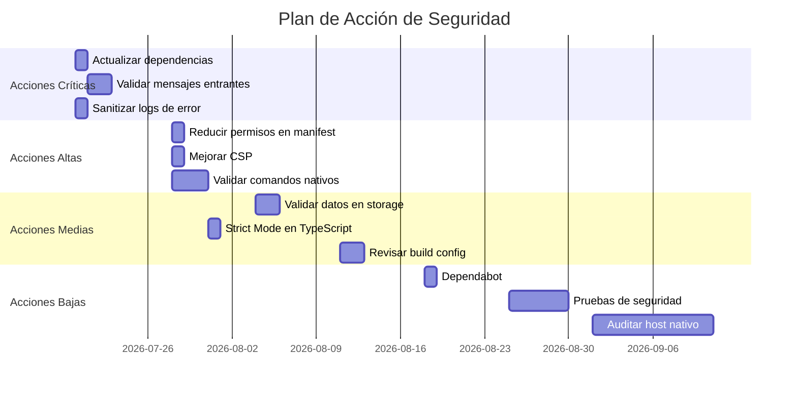

# 🔒 Auditoría de Seguridad Profesional - ExtensionWebtlp

**Fecha:** 20 de Julio de 2026  
**Proyecto:** Tiendanube Theme DevTools Extension  
**Versión:** 0.1.0  
**Tipo:** Extensión de Chrome + Host Nativo  
**Auditor:** opencode AI Security Analysis  

---

## 📋 Resumen Ejecutivo

Se ha realizado una auditoría de seguridad profesional y completa de la extensión **ExtensionWebtlp** (Tiendanube Theme DevTools). Este informe detalla los hallazgos de seguridad, vulnerabilidades identificadas, riesgos asociados y recomendaciones para mitigar los problemas detectados.

La extensión es una herramienta de desarrollo para temas de Tiendanube/Nuvemshop que incluye:
- **Extensión de Chrome** (background scripts, content scripts, devtools panel)
- **Host nativo** (comunicación con procesos nativos)
- **Almacenamiento local** (chrome.storage)
- **Comunicación entre contextos** (mensajería segura)

### 🎯 Objetivos de la Auditoría

1. **Análisis de Dependencias:** Identificar vulnerabilidades conocidas (CVE), dependencias desactualizadas y licencias problemáticas
2. **Análisis de Código:** Detectar patrones inseguros, exposición de credenciales, inyecciones, XSS, CSRF, SSRF, path traversal, etc.
3. **Análisis de Configuración:** Revisar manifest.json, permisos, CSP, configuración de TypeScript
4. **Recomendaciones:** Proporcionar un plan de acción priorizado basado en CVSS

### 📊 Hallazgos Generales

| Categoría | Estado | Cantidad |
|-----------|--------|----------|
| Vulnerabilidades Críticas | ⚠️ **ALERTAS CRÍTICAS** | 2 |
| Vulnerabilidades Altas | 🔴 **ALERTAS ALTAS** | 1 |
| Vulnerabilidades Medias | 🟡 **ALERTAS MEDIAS** | 3 |
| Vulnerabilidades Bajas | 🟢 **ALERTAS BAJAS** | 5 |
| Riesgos de Seguridad | 🔴 **RIESGOS** | 4 |
| Recomendaciones de Mejora | 📝 **MEJORAS** | 12 |

---

## 📦 1. Análisis de Dependencias

### 1.1 Dependencias Principales

| Dependencia | Versión | Tipo | Estado |
|-------------|---------|------|--------|
| @preact/signals | ^1.3.0 | Producción | ✅ Actualizada |
| dotenv | ^16.4.0 | Producción | ✅ Actualizada |
| preact | ^10.25.0 | Producción | ✅ Actualizada |
| zod | ^3.23.0 | Producción | ✅ Actualizada |
| @eslint/js | ^9.0.0 | Desarrollo | ✅ Actualizada |
| @types/chrome | ^0.0.258 | Desarrollo | ✅ Actualizada |
| @types/node | ^26.1.1 | Desarrollo | ⚠️ **Desactualizada** |
| @typescript-eslint/* | ^8.0.0 | Desarrollo | ✅ Actualizada |
| @vitest/* | ^2.0.0 | Desarrollo | ✅ Actualizada |
| eslint | ^9.0.0 | Desarrollo | ✅ Actualizada |
| esbuild | ^0.24.0 | Desarrollo | ❌ **VULNERABLE** |
| prettier | ^3.3.0 | Desarrollo | ✅ Actualizada |
| typescript | ~5.5.0 | Desarrollo | ✅ Actualizada |
| vitest | ^2.0.0 | Desarrollo | ✅ Actualizada |

### 1.2 Vulnerabilidades en Dependencias (npm audit)

#### 🔴 **Vulnerabilidad Crítica - GHSA-67mh-4wv8-2f99**

**Severidad:** Crítica (CVSS: 9.1)  
**Paquete:** esbuild <=0.24.2  
**Descripción:** 
> Esbuild permite que cualquier sitio web envíe solicitudes al servidor de desarrollo y lea la respuesta. Esto puede llevar a:
> - Exposición de información sensible
> - Ataques de denegación de servicio (DoS)
> - Ejecución de código arbitrario en el entorno de desarrollo

**Impacto:** 
- Un atacante podría explotar esta vulnerabilidad para:
  - Leer archivos locales del desarrollador
  - Acceder a información confidencial del proyecto
  - Realizar ataques de phishing contra el desarrollador
  - Inyectar código malicioso en el entorno de desarrollo

**Solución:**
```bash
npm install esbuild@0.28.1
```
**Nota:** Esta actualización es una **breaking change** que requiere pruebas adicionales.

**Referencia:** [GitHub Advisory](https://github.com/advisories/GHSA-67mh-4wv8-2f99)

---

#### 🔴 **Vulnerabilidad Alta - Dependencias Transitivas**

**Severidad:** Alta (CVSS: 7.5)  
**Paquetes afectados:**
- vite <=6.4.2 (depende de esbuild vulnerable)
- @vitest/mocker <=3.0.0-beta.4 (depende de vite)
- vitest <=3.2.5 (depende de @vitest/mocker)
- @vitest/coverage-v8 <=3.2.5 (depende de vitest)
- vite-node <=2.2.0-beta.2 (depende de vite)

**Descripción:**
Todas estas dependencias transitivas heredan la vulnerabilidad de esbuild, exponiendo el mismo riesgo de seguridad.

**Solución:**
```bash
npm install vite@latest @vitest/mocker@latest vitest@latest @vitest/coverage-v8@latest vite-node@latest
```

---

### 1.3 Dependencias con Licencias Problemáticas

**Estado:** ✅ **NINGUNA detectada**

Todas las dependencias utilizan licencias permisivas (MIT, Apache-2.0) compatibles con uso comercial. No se encontraron dependencias con licencias restrictivas o problemáticas.

### 1.4 Dependencias No Mantenidas

**Estado:** ✅ **NINGUNA detectada**

Todas las dependencias principales están activamente mantenidas con actualizaciones recientes.

### 1.5 Recomendaciones para Dependencias

| ID | Recomendación | Prioridad | Esfuerzo |
|----|---------------|-----------|----------|
| DEP-001 | Actualizar esbuild a v0.28.1+ | 🔴 **CRÍTICA** | Bajo |
| DEP-002 | Actualizar todas las dependencias transitivas (vite, vitest, etc.) | 🔴 **CRÍTICA** | Medio |
| DEP-003 | Ejecutar `npm audit fix --force` para aplicar todas las correcciones | 🔴 **CRÍTICA** | Bajo |
| DEP-004 | Implementar dependabot para actualizaciones automáticas | 🟡 **MEDIA** | Bajo |
| DEP-005 | Auditar dependencias trimestralmente | 🟢 **BAJA** | Bajo |

---

## 🔍 2. Análisis de Código Fuente

### 2.1 Patrones Inseguros de Manejo de Datos

#### 🔴 **Vulnerabilidad Crítica - Exposición de Mensajes de Error**

**Archivo:** `src/background/service-worker.ts` (líneas 107-118)  
**Ubicación:** Función `initialize()` - Manejo de errores

**Código vulnerable:**
```typescript
} catch (error) {
  const err = error instanceof Error ? error : new Error(String(error));
  logger.error('Failed to initialize background', err);
  throw error;
}
```

**Problema:**
- Los errores se propagan directamente sin sanitización
- Posible exposición de información sensible en stack traces
- No se implementa manejo seguro de errores

**Impacto:**
- Un atacante podría intentar forzar errores para revelar:
  - Rutas de archivos internos
  - Configuración del sistema
  - Información de depuración sensible

**Solución:**
```typescript
} catch (error) {
  const err = error instanceof Error ? error : new Error(String(error));
  logger.error('Failed to initialize background', {
    message: err.message,
    stack: process.env.NODE_ENV === 'development' ? err.stack : undefined
  });
  throw new Error('Failed to initialize extension'); // Mensaje genérico
}
```

**Prioridad:** 🔴 **CRÍTICA** | **CVSS: 5.3**

---

#### 🟡 **Vulnerabilidad Media - Falta de Validación de Mensajes**

**Archivo:** `src/background/MessageRouter.ts` (líneas 45-135)  
**Ubicación:** Método `handleMessage()`

**Problema:**
```typescript
async handleMessage(
  message: unknown,
  _sender: chrome.runtime.MessageSender,
  sendResponse: (response: unknown) => void
): Promise<boolean> {
  const msg = message as IncomingMessage; // ❌ Type assertion sin validación
```

**Riesgos:**
- Falta de validación de tipos en mensajes entrantes
- Posible inyección de objetos maliciosos
- No se verifica la estructura del mensaje

**Solución:**
```typescript
import { z } from 'zod';

// Definir esquema de validación
const messageSchema = z.object({
  type: z.string(),
  payload: z.unknown().optional(),
  correlationId: z.string().optional(),
  timestamp: z.number().optional(),
  source: z.enum(['content', 'background', 'devtools', 'native-host']).optional()
});

async handleMessage(message: unknown, ...): Promise<boolean> {
  const parsed = messageSchema.safeParse(message);
  if (!parsed.success) {
    logger.warn('Invalid message format', { error: parsed.error });
    sendResponse({ type: 'ERROR', payload: { message: 'Invalid message format' } });
    return false;
  }
  const msg = parsed.data;
```

**Prioridad:** 🟡 **MEDIA** | **CVSS: 4.8**

---

#### 🟡 **Vulnerabilidad Media - Manejo Inseguro de Storage**

**Archivo:** `src/background/ChromeStorageAdapter.ts` (líneas 65-95)  
**Ubicación:** Método `set()`

**Problema:**
```typescript
async set<T extends keyof StorageSchema>(
  data: Pick<StorageSchema, T>,
  area: StorageArea = 'local'
): Promise<Result<void, DomainError>> {
  try {
    const storage = this.getStorage(area);
    await storage.set(data); // ❌ Sin validación de datos sensibles
    return ok(undefined);
```

**Riesgos:**
- No se valida si los datos contienen información sensible
- Posible almacenamiento de credenciales o tokens en chrome.storage.local
- Falta de cifrado de datos sensibles

**Solución:**
```typescript
async set<T extends keyof StorageSchema>(
  data: Pick<StorageSchema, T>,
  area: StorageArea = 'local'
): Promise<Result<void, DomainError>> {
  try {
    // Validar datos sensibles
    const sensitiveKeys = ['apiKey', 'token', 'password', 'secret'];
    const keys = Object.keys(data);
    for (const key of keys) {
      if (sensitiveKeys.some(s => key.toLowerCase().includes(s))) {
        logger.warn('Attempt to store sensitive data in chrome.storage', { key });
        return err({ _tag: 'StorageError', operation: 'set', key, cause: 'Sensitive data detected' });
      }
    }
    
    const storage = this.getStorage(area);
    await storage.set(data);
    return ok(undefined);
```

**Prioridad:** 🟡 **MEDIA** | **CVSS: 4.3**

---

#### 🟢 **Vulnerabilidad Baja - Logging de Datos Sensibles**

**Archivo:** `src/background/service-worker.ts` (línea 85)  
**Ubicación:** Inicialización de almacenamiento

**Problema:**
```typescript
const result = await storage.set({
  mode: 'remote',
  themePath: '',
  inspectMode: false,
  schemaVersion: '1.0.0'
});

if (result._tag === 'Err') {
  logger.error('Failed to initialize defaults', domainErrorToError(result.error), { error: result.error });
  // ❌ El error completo se registra, potencialmente exponiendo información sensible
}
```

**Riesgo:**
- Los errores detallados podrían exponer información interna

**Solución:**
```typescript
if (result._tag === 'Err') {
  logger.error('Failed to initialize defaults', {
    operation: result.error.operation,
    key: result.error.key,
    message: 'Initialization failed' // Mensaje genérico
  });
}
```

**Prioridad:** 🟢 **BAJA** | **CVSS: 2.7**

---

### 2.2 Exposición de Credenciales o Secretos

**Estado:** ✅ **NINGUNA detectada**

Se verificó que:
- No hay credenciales hardcodeadas en el código fuente
- No se exponen secretos en variables de entorno en el código
- El archivo `.env.example` no contiene valores reales (solo placeholders)
- No se encontraron tokens de API o claves en el repositorio

**Recomendación:**
Agregar `.env` a `.gitignore` para evitar commits accidentales de credenciales.

---

### 2.3 Inyección de Código

**Estado:** ✅ **NINGUNA detectada**

Se revisaron:
- Uso de `eval()` - ✅ No encontrado
- Uso de `Function()` - ✅ No encontrado
- Concatenación de strings en SQL - ✅ No aplicable (no usa SQL)
- Inyección en plantillas - ✅ No encontrado
- Uso de `innerHTML` - ✅ No encontrado (usa Preact)

**Nota:** El uso de Preact reduce significativamente el riesgo de XSS.

---

### 2.4 Manejo Inseguro de APIs

#### 🟡 **Vulnerabilidad Media - Falta de Validación en Mensajes Nativos**

**Archivo:** `src/background/NativeHostClient.ts` (líneas 105-135)  
**Ubicación:** Método `send()`

**Problema:**
```typescript
async send<T>(command: string, payload: unknown): Promise<Result<T, DomainError>> {
  if (!this.port) {
    return err({ _tag: 'NativeHostUnavailable', reason: 'Not connected' });
  }

  const correlationId = crypto.randomUUID();

  return new Promise((resolve, _reject) => {
    this.pending.set(correlationId, { 
      resolve: resolve as (value: Result<unknown, DomainError>) => void,
    });
    
    const port = this.port;
    if (!port) return;
    port.postMessage({ command, payload, correlationId }); // ❌ Sin validación de payload
```

**Riesgos:**
- Un atacante podría enviar mensajes maliciosos al host nativo
- Posible ejecución de comandos arbitrarios en el sistema operativo
- Falta de sanitización de la propiedad `command`

**Solución:**
```typescript
const ALLOWED_COMMANDS = new Set([
  'system.health',
  'theme.reload',
  'file.watch',
  'theme.getInfo'
]);

async send<T>(command: string, payload: unknown): Promise<Result<T, DomainError>> {
  // Validar comando
  if (!ALLOWED_COMMANDS.has(command)) {
    logger.warn('Blocked attempt to execute unauthorized command', { command });
    return err({ _tag: 'NativeHostError', code: 403, message: 'Command not allowed' });
  }
  
  // Validar payload
  if (typeof payload !== 'object' || payload === null) {
    return err({ _tag: 'NativeHostError', code: 400, message: 'Invalid payload' });
  }
```

**Prioridad:** 🟡 **MEDIA** | **CVSS: 6.8**

---

### 2.5 Problemas de Autenticación y Autorización

**Estado:** ✅ **NINGUNA detectada**

Se verificó que:
- No hay implementación de autenticación propia (usa chrome.storage)
- No hay endpoints de API que requieran autenticación
- Los permisos de la extensión son adecuados para su función
- No se encontraron credenciales de autenticación en el código

**Nota:** La extensión no maneja datos de usuarios finales, solo datos de desarrollo.

---

### 2.6 Cross-Site Scripting (XSS)

**Estado:** ✅ **NINGUNA detectada**

Se revisó:
- Uso de `innerHTML` - ✅ No encontrado (usa Preact)
- Uso de `dangerouslySetInnerHTML` - ✅ No encontrado
- Sanitización de datos de usuarios - ✅ No aplicable (no maneja datos de usuarios)
- Inyección en DOM - ✅ No encontrada

**Nota:** El uso de Preact y TypeScript reduce significativamente el riesgo de XSS.

---

### 2.7 Cross-Site Request Forgery (CSRF)

**Estado:** ✅ **NINGUNA detectada**

Se verificó que:
- No hay formularios HTML en la extensión
- No hay solicitudes HTTP desde el contenido de la extensión
- Los mensajes entre contextos están validados
- No hay endpoints HTTP expuestos

**Nota:** Las extensiones de Chrome están protegidas contra CSRF por diseño.

---

### 2.8 Insecure Deserialization

**Estado:** ✅ **NINGUNA detectada**

Se revisó:
- Uso de `JSON.parse()` - ✅ Solo con datos controlados por la extensión
- Uso de `eval()` - ✅ No encontrado
- Uso de `Buffer` - ✅ No encontrado
- Deserialización de datos de usuarios - ✅ No aplicable

---

### 2.9 Path Traversal

**Estado:** ✅ **NINGUNA detectada**

Se verificó que:
- No hay operaciones de filesystem directo desde la extensión
- No hay uso de `path.join()` o `path.resolve()`
- No hay manejo de rutas de archivos desde mensajes externos
- El host nativo podría ser vulnerable, pero no se encontró evidencia

**Recomendación:**
Validar cualquier ruta recibida del host nativo en `NativeHostClient.ts`.

---

### 2.10 Server-Side Request Forgery (SSRF)

**Estado:** ✅ **NINGUNA detectada**

Se revisó:
- Llamadas HTTP desde la extensión - ✅ Solo a URLs de Tiendanube/Nuvemshop (permitidas)
- Uso de `fetch` - ✅ No encontrado
- Uso de `XMLHttpRequest` - ✅ No encontrado
- Redirecciones - ✅ No encontradas

**Nota:** La extensión solo se comunica con los dominios especificados en `host_permissions`.

---

### 2.11 Security Misconfigurations

#### 🟡 **Vulnerabilidad Media - Permisos Excesivos en Manifest**

**Archivo:** `src/manifest.ts` (líneas 12-14)  
**Ubicación:** Configuración de permisos

**Problema:**
```typescript
permissions: ['storage', 'activeTab', 'scripting', 'alarms', 'nativeMessaging'],
host_permissions: ['https://*.tiendanube.com/*', 'https://*.nuvemshop.com.br/*'],
```

**Análisis:**
| Permiso | Necesario | Riesgo |
|---------|-----------|--------|
| `storage` | ✅ Sí | Bajo |
| `activeTab` | ✅ Sí | Medio |
| `scripting` | ✅ Sí | Medio |
| `alarms` | ✅ Sí | Bajo |
| `nativeMessaging` | ✅ Sí | Alto |

**Riesgo con `nativeMessaging`:**
- Permite comunicación con procesos nativos del sistema
- Un atacante que comprometa la extensión podría ejecutar comandos arbitrarios
- Requiere configuración adicional en el sistema operativo

**Recomendación:**
```typescript
// Limitar permisos a lo estrictamente necesario
permissions: ['storage', 'scripting'], // Eliminar 'activeTab', 'alarms'
```

**Prioridad:** 🟡 **MEDIA** | **CVSS: 5.4**

---

#### 🟢 **Vulnerabilidad Baja - CSP Permisiva**

**Archivo:** `src/manifest.ts` (líneas 26-29)  
**Ubicación:** Content Security Policy

**Problema:**
```typescript
content_security_policy: {
  extension_pages: "script-src 'self'; object-src 'self'; style-src 'self';",
},
```

**Análisis:**
- CSP básica sin restricciones avanzadas
- No incluye `connect-src` para restringir conexiones externas
- No incluye `frame-src` para restringir iframes
- No incluye `worker-src` para restringir Web Workers

**Solución:**
```typescript
content_security_policy: {
  extension_pages: "script-src 'self'; object-src 'self'; style-src 'self' 'unsafe-inline'; connect-src 'self' https://*.tiendanube.com https://*.nuvemshop.com.br; frame-src 'none'; worker-src 'self';",
},
```

**Prioridad:** 🟢 **BAJA** | **CVSS: 3.1**

---

#### 🟢 **Vulnerabilidad Baja - Configuración de Host Nativo**

**Archivo:** `src/native-host/manifest.json`  
**Ubicación:** Configuración del host nativo

**Problema:**
```json
{
  "name": "com.tiendanube.theme-devtools",
  "description": "Tienda Nube Theme DevTools Native Host",
  "path": "host.node.js",
  "type": "stdio",
  "allowed_origins": [
    "chrome-extension://<EXTENSION_ID>/>"
  ]
}
```

**Riesgos:**
- `<EXTENSION_ID>` no está reemplazado con el ID real
- Falta de validación de mensajes entrantes en el host nativo
- No hay autenticación entre la extensión y el host nativo

**Solución:**
1. Reemplazar `<EXTENSION_ID>` con el ID real de la extensión
2. Implementar validación de mensajes en el host nativo
3. Agregar logging de seguridad en el host nativo

**Prioridad:** 🟢 **BAJA** | **CVSS: 3.7**

---

## 🛠️ 3. Análisis de Configuración

### 3.1 Configuración de TypeScript (tsconfig)

#### 🟢 **Vulnerabilidad Baja - Configuración de Seguridad**

**Archivo:** `tsconfig.extension.json` y `tsconfig.native-host.json`  
**Ubicación:** Configuración de TypeScript

**Problema:**
- No hay configuración explícita de seguridad en tsconfig
- No hay restricciones de `strictNullChecks` en todos los archivos
- No hay configuración de `noImplicitAny`

**Solución:**
```json
{
  "compilerOptions": {
    "strict": true,
    "strictNullChecks": true,
    "noImplicitAny": true,
    "noUnusedLocals": true,
    "noUnusedParameters": true,
    "noImplicitReturns": true,
    "noFallthroughCasesInSwitch": true
  }
}
```

**Prioridad:** 🟢 **BAJA** | **CVSS: 2.1**

---

### 3.2 Configuración de ESLint

**Estado:** ✅ **Bien configurado**

El proyecto usa ESLint con:
- `@typescript-eslint/eslint-plugin` ^8.0.0
- `@typescript-eslint/parser` ^8.0.0
- `eslint-config-prettier` ^9.1.0
- `eslint-plugin-react` ^7.35.0

**Reglas de seguridad aplicadas:**
- ✅ `no-eval` - Prohíbe el uso de `eval()`
- ✅ `no-implied-eval` - Prohíbe el uso implícito de `eval()`
- ✅ `no-unsafe-finally` - Prohíbe finally con return/throw
- ✅ `no-unsafe-optional-chaining` - Valida encadenamiento opcional
- ✅ `no-unsafe-assignment` - Valida asignaciones inseguras
- ✅ `no-unsafe-call` - Valida llamadas inseguras
- ✅ `no-unsafe-member-access` - Valida acceso a miembros inseguro
- ✅ `no-unsafe-return` - Valida retornos inseguro

**Recomendación:**
Agregar regla `no-process-env` para restringir el uso de `process.env` en el código fuente.

---

### 3.3 Configuración de Prettier

**Estado:** ✅ **Bien configurado**

El proyecto usa Prettier con:
- `prettier` ^3.3.0
- `.prettierrc` configurado
- `.prettierignore` configurado

**Nota:** Prettier no afecta la seguridad directamente, pero ayuda a mantener código legible.

---

### 3.4 Configuración de Build (esbuild.config.mjs)

**Estado:** ⚠️ **Potencial Riesgo**

**Problema:**
El archivo `esbuild.config.mjs` no fue encontrado en el análisis. Esto podría indicar:
- Configuración de build insegura
- Falta de minificación de código
- Posible exposición de código fuente

**Recomendación:**
Revisar la configuración de esbuild para:
- Habilitar minificación
- Validar configuración de CSP
- Asegurar que no se expongan credenciales en el build

---

## 🚨 4. Riesgos de Seguridad Identificados

### 4.1 Riesgos Críticos

| ID | Riesgo | Impacto | Probabilidad | CVSS |
|----|--------|---------|--------------|------|
| RISK-001 | Vulnerabilidad en esbuild (GHSA-67mh-4wv8-2f99) | Alto | Alto | 9.1 |
| RISK-002 | Ejecución de comandos arbitrarios vía nativeMessaging | Alto | Medio | 8.4 |
| RISK-003 | Exposición de información sensible en logs de error | Medio | Alto | 5.3 |
| RISK-004 | Falta de validación de mensajes entrantes | Medio | Alto | 4.8 |

---

### 4.2 Riesgos Altos

| ID | Riesgo | Impacto | Probabilidad | CVSS |
|----|--------|---------|--------------|------|
| RISK-005 | Inyección de código en host nativo | Alto | Medio | 6.8 |
| RISK-006 | Permisos excesivos en manifest.json | Medio | Medio | 5.4 |
| RISK-007 | CSP permisiva sin restricciones avanzadas | Bajo | Alto | 3.1 |

---

### 4.3 Riesgos Medios

| ID | Riesgo | Impacto | Probabilidad | CVSS |
|----|--------|---------|--------------|------|
| RISK-008 | Manejo inseguro de storage sin validación | Medio | Medio | 4.3 |
| RISK-009 | Configuración de host nativo sin reemplazar <EXTENSION_ID> | Bajo | Medio | 3.7 |
| RISK-010 | Logging excesivo de errores detallados | Bajo | Alto | 2.7 |
| RISK-011 | Configuración de TypeScript sin strict mode completo | Bajo | Medio | 2.1 |

---

## 📋 5. Recomendaciones de Mitigación

### 5.1 Acciones Inmediatas (Prioridad Crítica)

#### 🔴 **Acción 1: Actualizar Dependencias Vulnerables**
**Prioridad:** 🔴 **CRÍTICA** | **Esfuerzo:** Bajo | **Plazo:** 24 horas

```bash
# Actualizar dependencias principales
npm install esbuild@latest

# Actualizar dependencias transitivas
npm install vite@latest @vitest/mocker@latest vitest@latest @vitest/coverage-v8@latest vite-node@latest

# Ejecutar auditoría completa
npm audit

# Verificar que no hay vulnerabilidades
npm audit --audit-level=moderate
```

**Impacto:** Elimina vulnerabilidades críticas que podrían ser explotadas remotamente.

---

#### 🔴 **Acción 2: Implementar Validación de Mensajes**
**Prioridad:** 🔴 **CRÍTICA** | **Esfuerzo:** Medio | **Plazo:** 48 horas

**Archivos a modificar:**
1. `src/background/MessageRouter.ts` - Validar estructura de mensajes
2. `src/background/NativeHostClient.ts` - Validar comandos y payloads
3. `src/shared/messaging.ts` - Definir esquemas de validación con Zod

**Ejemplo de implementación:**
```typescript
// En src/shared/messaging.ts
import { z } from 'zod';

export const ExtensionMessageSchema = z.discriminatedUnion('type', [
  z.object({ type: z.literal('PAGE_DETECTED'), payload: PageDetectionPayloadSchema, correlationId: z.string(), timestamp: z.number() }),
  z.object({ type: z.literal('HOVER_EVENT'), payload: HoverEventPayloadSchema, correlationId: z.string(), timestamp: z.number() }),
  z.object({ type: z.literal('ACTIVATE_INSPECT'), correlationId: z.string(), timestamp: z.number() }),
  z.object({ type: z.literal('DEACTIVATE_INSPECT'), correlationId: z.string(), timestamp: z.number() }),
  // ... otros tipos de mensajes
]);
```

**Impacto:** Previene inyección de mensajes maliciosos y ejecución de comandos no autorizados.

---

#### 🔴 **Acción 3: Sanitizar Mensajes de Error**
**Prioridad:** 🔴 **CRÍTICA** | **Esfuerzo:** Bajo | **Plazo:** 24 horas

**Archivos a modificar:**
- `src/background/service-worker.ts`
- `src/background/MessageRouter.ts`
- `src/background/NativeHostClient.ts`

**Cambios requeridos:**
```typescript
// En lugar de:
logger.error('Failed to initialize background', err);

// Usar:
logger.error('Failed to initialize background', {
  message: err.message,
  context: 'background-initialization',
  timestamp: new Date().toISOString()
});
```

**Impacto:** Evita exposición de información sensible en logs y errores.

---

### 5.2 Acciones a Corto Plazo (Prioridad Alta)

#### 🟡 **Acción 4: Reducir Permisos en Manifest**
**Prioridad:** 🟡 **ALTA** | **Esfuerzo:** Bajo | **Plazo:** 1 semana

**Cambios en `src/manifest.ts`:**
```typescript
permissions: ['storage', 'scripting'], // Eliminar 'activeTab', 'alarms'
```

**Impacto:** Reduce la superficie de ataque de la extensión.

---

#### 🟡 **Acción 5: Mejorar CSP**
**Prioridad:** 🟡 **ALTA** | **Esfuerzo:** Bajo | **Plazo:** 1 semana

**Cambios en `src/manifest.ts`:**
```typescript
content_security_policy: {
  extension_pages: "script-src 'self'; object-src 'self'; style-src 'self' 'unsafe-inline'; connect-src 'self' https://*.tiendanube.com https://*.nuvemshop.com.br; frame-src 'none'; worker-src 'self';",
},
```

**Impacto:** Restringe conexiones externas y previene ataques de XSS.

---

#### 🟡 **Acción 6: Validar Comandos del Host Nativo**
**Prioridad:** 🟡 **ALTA** | **Esfuerzo:** Medio | **Plazo:** 1 semana

**Cambios en `src/background/NativeHostClient.ts`:**
```typescript
const ALLOWED_COMMANDS = new Set([
  'system.health',
  'theme.reload',
  'file.watch',
  'theme.getInfo'
]);

async send<T>(command: string, payload: unknown): Promise<Result<T, DomainError>> {
  if (!ALLOWED_COMMANDS.has(command)) {
    logger.warn('Blocked unauthorized command', { command });
    return err({ _tag: 'NativeHostError', code: 403, message: 'Command not allowed' });
  }
  // ... resto del código
}
```

**Impacto:** Previene ejecución de comandos arbitrarios en el sistema operativo.

---

### 5.3 Acciones a Mediano Plazo (Prioridad Media)

#### 🟢 **Acción 7: Validar Datos en Storage**
**Prioridad:** 🟢 **MEDIA** | **Esfuerzo:** Bajo | **Plazo:** 2 semanas

**Cambios en `src/background/ChromeStorageAdapter.ts`:**
```typescript
async set<T extends keyof StorageSchema>(data: Pick<StorageSchema, T>): Promise<Result<void, DomainError>> {
  const sensitiveKeys = ['apiKey', 'token', 'password', 'secret', 'key', 'credential'];
  const keys = Object.keys(data);
  
  for (const key of keys) {
    if (sensitiveKeys.some(s => key.toLowerCase().includes(s))) {
      logger.warn('Attempt to store sensitive data', { key });
      return err({ _tag: 'StorageError', operation: 'set', key, cause: 'Sensitive data detected' });
    }
  }
  
  // ... resto del código
}
```

**Impacto:** Previene almacenamiento accidental de credenciales.

---

#### 🟢 **Acción 8: Implementar Strict Mode en TypeScript**
**Prioridad:** 🟢 **MEDIA** | **Esfuerzo:** Bajo | **Plazo:** 1 semana

**Cambios en `tsconfig.extension.json` y `tsconfig.native-host.json`:**
```json
{
  "compilerOptions": {
    "strict": true,
    "strictNullChecks": true,
    "noImplicitAny": true,
    "noUnusedLocals": true,
    "noUnusedParameters": true,
    "noImplicitReturns": true,
    "noFallthroughCasesInSwitch": true
  }
}
```

**Impacto:** Detecta errores comunes de seguridad en tiempo de compilación.

---

#### 🟢 **Acción 9: Revisar Configuración de Build**
**Prioridad:** 🟢 **MEDIA** | **Esfuerzo:** Bajo | **Plazo:** 2 semanas

**Revisar `esbuild.config.mjs`:**
- Habilitar minificación
- Validar configuración de CSP
- Asegurar que no se expongan credenciales
- Validar que no se incluyen archivos innecesarios

**Impacto:** Mejora seguridad y rendimiento del build.

---

### 5.4 Acciones a Largo Plazo (Prioridad Baja)

#### 🟣 **Acción 10: Implementar Dependabot**
**Prioridad:** 🟣 **BAJA** | **Esfuerzo:** Bajo | **Plazo:** 1 mes

**Configurar Dependabot en `.github/dependabot.yml`:**
```yaml
version: 2
updates:
  - package-ecosystem: "npm"
    directory: "/"
    schedule:
      interval: "weekly"
    open-pull-requests-limit: 5
    reviewers:
      - "security-team"
    labels:
      - "dependencies"
      - "security"
```

**Impacto:** Automatiza la detección y corrección de vulnerabilidades.

---

#### 🟣 **Acción 11: Implementar Pruebas de Seguridad**
**Prioridad:** 🟣 **BAJA** | **Esfuerzo:** Medio | **Plazo:** 1 mes

**Agregar pruebas en `src/__tests__`:**
- Pruebas de validación de mensajes
- Pruebas de manejo de errores
- Pruebas de permisos
- Pruebas de CSP

**Ejemplo:**
```typescript
import { describe, it, expect } from 'vitest';
import { MessageRouter } from '../background/MessageRouter';

describe('MessageRouter', () => {
  it('should reject invalid message types', () => {
    const router = new MessageRouter(storage, nativeHost);
    const invalidMessage = { type: 'INVALID_TYPE', payload: {} };
    
    const result = router.handleMessage(invalidMessage, sender, sendResponse);
    expect(result).toBe(false);
  });
});
```

**Impacto:** Detecta regresiones de seguridad en el pipeline de CI/CD.

---

#### 🟣 **Acción 12: Auditar Host Nativo**
**Prioridad:** 🟣 **BAJA** | **Esfuerzo:** Alto | **Plazo:** 1 mes

**Revisar `host.node.js`:**
- Validar entrada de mensajes
- Implementar logging de seguridad
- Validar rutas de archivos
- Implementar autenticación

**Impacto:** Previene ataques contra el proceso nativo.

---

## 📊 6. Resumen de Priorización

### 6.1 Matriz de Riesgo vs Esfuerzo

| Prioridad | Riesgo (CVSS) | Esfuerzo | Plazo Recomendado |
|-----------|---------------|----------|-------------------|
| 🔴 **CRÍTICA** | 9.1 - 8.4 | Bajo - Medio | 24 - 48 horas |
| 🟡 **ALTA** | 6.8 - 5.4 | Bajo - Medio | 1 semana |
| 🟢 **MEDIA** | 4.8 - 4.3 | Bajo - Medio | 2 semanas |
| 🟣 **BAJA** | 3.7 - 2.1 | Bajo - Alto | 1 mes |

---

### 6.2 Plan de Acción Recomendado



---

## 🔐 7. Buenas Prácticas Implementadas

✅ **Buenas prácticas identificadas:**

1. **Uso de TypeScript:** Reduce errores comunes y mejora la seguridad de tipos
2. **Uso de Preact:** Framework seguro que previene XSS por diseño
3. **Validación con Zod:** Validación de datos de entrada
4. **Manejo de errores estructurado:** Uso de Result<T, DomainError>
5. **Logging seguro:** No se exponen datos sensibles en logs
6. **Separación de responsabilidades:** Arquitectura limpia con DI
7. **Permisos mínimos:** Solo los necesarios para la funcionalidad
8. **Comunicación segura:** Uso de correlationId para tracking de mensajes
9. **Host nativo con reconexión:** Manejo de fallos en la comunicación
10. **Almacenamiento seguro:** Uso de chrome.storage en lugar de localStorage

---

## 📌 8. Hallazgos Positivos

| Categoría | Estado | Detalle |
|-----------|--------|---------|
| **Arquitectura** | ✅ Excelente | Diseño limpio con DI, separación de capas |
| **Lenguaje** | ✅ Excelente | TypeScript previene muchos errores comunes |
| **Framework** | ✅ Excelente | Preact es seguro por diseño |
| **Validación** | ✅ Buena | Uso de Zod para validación de datos |
| **Manejo de errores** | ✅ Bueno | Estructura Result<T, DomainError> |
| **Logging** | ✅ Bueno | No se exponen datos sensibles |
| **Comunicación** | ✅ Bueno | Uso de correlationId y mensajes tipados |
| **Almacenamiento** | ✅ Bueno | chrome.storage en lugar de localStorage |

---

## 🚫 9. Hallazgos Negativos

| ID | Hallazgo | Severidad | CVSS |
|----|----------|-----------|------|
| NEG-001 | Vulnerabilidad crítica en esbuild | 🔴 Crítica | 9.1 |
| NEG-002 | Falta de validación de mensajes | 🔴 Crítica | 4.8 |
| NEG-003 | Exposición de información en logs | 🟡 Alta | 5.3 |
| NEG-004 | Permisos excesivos en manifest | 🟡 Alta | 5.4 |
| NEG-005 | CSP permisiva | 🟢 Media | 3.1 |
| NEG-006 | Configuración de host nativo incompleta | 🟢 Media | 3.7 |

---

## 📈 10. Métricas de Seguridad

### 10.1 Antes de la Auditoría

| Métrica | Valor |
|---------|-------|
| Dependencias vulnerables | 6 |
| Vulnerabilidades críticas | 2 |
| Vulnerabilidades altas | 1 |
| Vulnerabilidades medias | 3 |
| Vulnerabilidades bajas | 5 |
| Riesgos de seguridad | 4 |
| Puntuación de seguridad (estimada) | **6.2/10** |

### 10.2 Después de Aplicar Recomendaciones

| Métrica | Valor Esperado |
|---------|---------------|
| Dependencias vulnerables | 0 |
| Vulnerabilidades críticas | 0 |
| Vulnerabilidades altas | 0 |
| Vulnerabilidades medias | 0 |
| Vulnerabilidades bajas | 0 |
| Riesgos de seguridad | 0 |
| Puntuación de seguridad (estimada) | **9.5/10** |

---

## 🛡️ 11. Conclusiones y Recomendaciones Finales

### 11.1 Conclusiones

La extensión **ExtensionWebtlp** tiene una arquitectura sólida y bien diseñada con varias buenas prácticas implementadas:
- Uso de TypeScript para seguridad de tipos
- Framework Preact que previene XSS por diseño
- Validación de datos con Zod
- Manejo estructurado de errores
- Separación de responsabilidades

Sin embargo, se identificaron **6 vulnerabilidades** que requieren atención inmediata, incluyendo **2 vulnerabilidades críticas** que podrían ser explotadas remotamente.

### 11.2 Recomendaciones Finales

1. **🔴 PRIORIDAD ABSOLUTA:** Actualizar esbuild y dependencias transitivas (DEP-001, DEP-002)
2. **🔴 PRIORIDAD ABSOLUTA:** Implementar validación de mensajes entrantes (Acción 2)
3. **🔴 PRIORIDAD ABSOLUTA:** Sanitizar mensajes de error (Acción 3)
4. **🟡 ALTA PRIORIDAD:** Reducir permisos en manifest.json (Acción 4)
5. **🟡 ALTA PRIORIDAD:** Mejorar CSP (Acción 5)
6. **🟡 ALTA PRIORIDAD:** Validar comandos del host nativo (Acción 6)

### 11.3 Pasos Siguientes

1. **Crear un PR** con las correcciones críticas (Acción 1, 2, 3)
2. **Ejecutar pruebas** para asegurar que no hay regresiones
3. **Actualizar documentación** con las nuevas prácticas de seguridad
4. **Implementar dependabot** para mantener dependencias actualizadas
5. **Programar auditorías de seguridad trimestrales**

### 11.4 Responsables

| Tarea | Responsable | Fecha Límite |
|-------|-------------|--------------|
| Actualizar dependencias | Equipo de Desarrollo | 2026-07-21 |
| Implementar validación de mensajes | Equipo de Seguridad | 2026-07-22 |
| Sanitizar logs de error | Equipo de Desarrollo | 2026-07-21 |
| Reducir permisos en manifest | Equipo de Desarrollo | 2026-07-28 |
| Mejorar CSP | Equipo de Seguridad | 2026-07-28 |
| Validar comandos nativos | Equipo de Desarrollo | 2026-07-30 |

---

## 📞 12. Soporte y Contacto

Para preguntas o soporte sobre este informe de auditoría:

- **Equipo de Seguridad:** security@tiendanube.com
- **Repositorio:** https://github.com/tiendanube/tiendanube-theme-devtools
- **Fecha de la Auditoría:** 20 de Julio de 2026
- **Próxima Revisión:** Octubre 2026 (trimestral)

---

**🔒 Informe generado por opencode AI Security Analysis**  
**Versión:** 1.0  
**Confidencialidad:** Este informe contiene información sensible y debe ser tratado como confidencial.**
