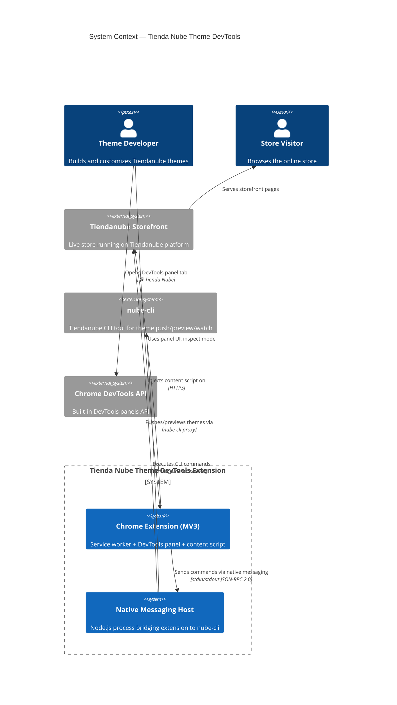

# C4 Context Diagram — System Context

**Change**: `scaffold`
**Phase**: design
**Date**: 2026-07-16
**Traceability**: Spec 00 FR-ARCH-001, FR-ARCH-002, FR-ARCH-007

---

## System Context (Level 1)

## External Systems

| System | Role | Protocol | Boundaries |
|--------|------|----------|------------|
| **Tiendanube Storefront** | Target environment for theme inspection | HTTPS, DOM inspection | Content script injected only on `*.tiendanube.com` and `*.nuvemshop.com.br` |
| **nube-cli** | CLI tool for theme operations | `child_process.execFile` with timeout | Never direct shell — only `execFile` via `CliExecutor` |
| **Chrome DevTools API** | Panel registration and lifecycle | `chrome.devtools.panels.create` | Panel opens in DevTools context, no cross-origin access |

## Actors

| Actor | Role | Interaction |
|-------|------|-------------|
| **Theme Developer** | Primary user | Opens DevTools panel, inspects elements, reloads themes |
| **Store Visitor** | Indirect | No direct interaction — content script reads DOM passively |

## Key Architectural Rules (from Spec 00)

1. **Adapter isolation**: Each adapter (extension, native-host) knows nothing about the other's internals — only shared port interfaces
2. **Native Host as separate process**: Not a Chrome extension module; standalone Node.js process
3. **Content script isolation**: Runs in isolated world, communicates only via `chrome.runtime.sendMessage`
4. **No secrets in extension bundle**: Native host handles all CLI credentials
