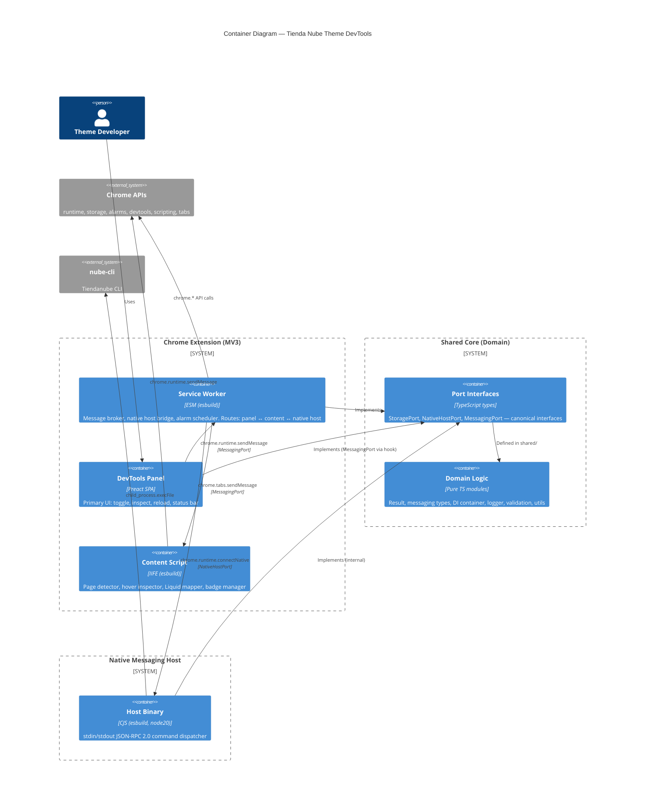

# C4 Container Diagram — Containers

**Change**: `scaffold`
**Phase**: design
**Date**: 2026-07-16
**Traceability**: Spec 00 FR-ARCH-001, FR-ARCH-007, FR-ARCH-009

---

## Container Diagram (Level 2)

## Container Details

### Chrome Extension (MV3) — esbuild-bundled

| Container | Entry Point | Output | Format | Size Budget |
|-----------|-------------|--------|--------|-------------|
| Service Worker | `src/background/service-worker.ts` | `dist/background/service-worker.js` | ESM | ≤ 15 KB |
| DevTools Panel | `src/devtools/panel/Panel.tsx` | Bundled within `dist/devtools/` | ESM (JSX → JS) | ≤ 50 KB |
| Content Script | `src/content/inspector.ts` | `dist/content/inspector.js` | IIFE | ≤ 10 KB |

### Shared Core — Domain Layer (Zero Runtime Dependencies)

| Module | File | Responsibility |
|--------|------|----------------|
| Result | `src/shared/result.ts` | `Ok/Err` discriminated union with combinators |
| Errors | `src/shared/errors.ts` | `DomainError` — tagged union of all error variants |
| Messaging | `src/shared/messaging.ts` | `ExtensionMessage` discriminated union + `createMessage()` |
| DI | `src/shared/di.ts` | Lightweight container with branded tokens |
| Logger | `src/shared/logger.ts` | Logger interface + implementations |
| Validation | `src/shared/validation.ts` | Zod schema wrappers + `validate()` |
| Config | `src/shared/config.ts` | ExtensionConfig + HostConfig + loadConfig() |
| Storage | `src/shared/storage.ts` | Chrome storage wrapper (Result-based) |
| Ports | `src/shared/ports/*.ts` | 3 canonical port interfaces |
| Utils | `src/shared/utils.ts` | Pure utilities (debounce, uuid, etc.) |
| Types | `src/shared/types/chrome.d.ts` | Chrome API augmentations |

### Native Messaging Host — Node.js 20+

| Module | File | Responsibility |
|--------|------|----------------|
| Entry | `src/native-host/main.ts` | CLI entry with `--health`, `push`, `preview`, `watch` |
| Transport | `src/native-host/StdioTransport.ts` | Framed stdin/stdout + JSON-RPC 2.0 framing |
| Bus | `src/native-host/CommandBus.ts` | Handler registry + middleware pipeline |
| Config | `src/native-host/config.ts` | Zod-validated host config |
| Security | `src/native-host/validate.ts` | Path + arg sanitization |
| Executor | `src/native-host/CliExecutor.ts` | `execFile` wrapper with timeout, no shell |

## Chrome API Usage Per Container

| Chrome API | Service Worker | DevTools Panel | Content Script |
|------------|:---:|:---:|:---:|
| `runtime.onMessage` / `runtime.sendMessage` | ✅ (router) | ✅ (hook) | ✅ (handler) |
| `runtime.connectNative` | ✅ (NativeHostClient) | ❌ | ❌ |
| `storage.local` | ✅ (ChromeStorageAdapter) | ✅ (via hook) | ❌ (read-only via messaging) |
| `alarms` | ✅ (health, reload check) | ❌ | ❌ |
| `devtools.panels` | ❌ | ✅ (registration) | ❌ |
| `tabs.sendMessage` | ✅ (to content) | ❌ | ❌ |
| `scripting` | ✅ (programmatic injection) | ❌ | ❌ |
