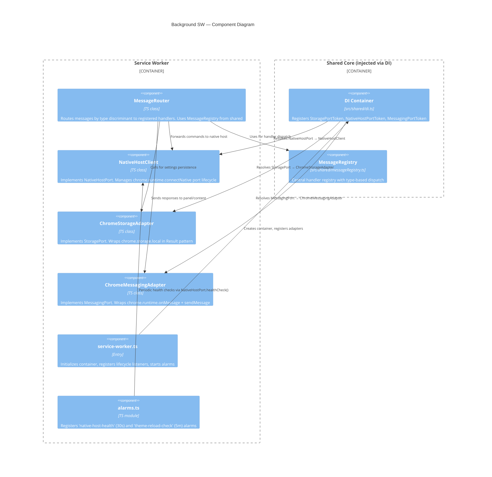
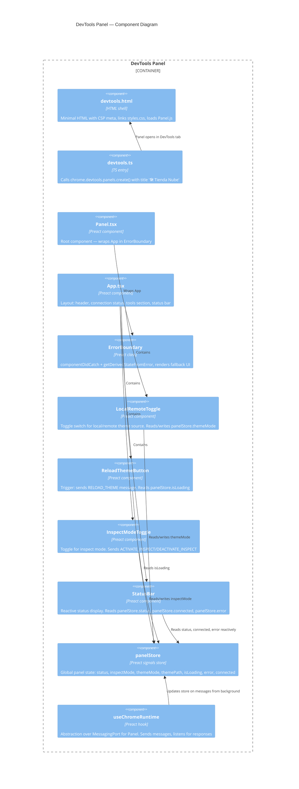
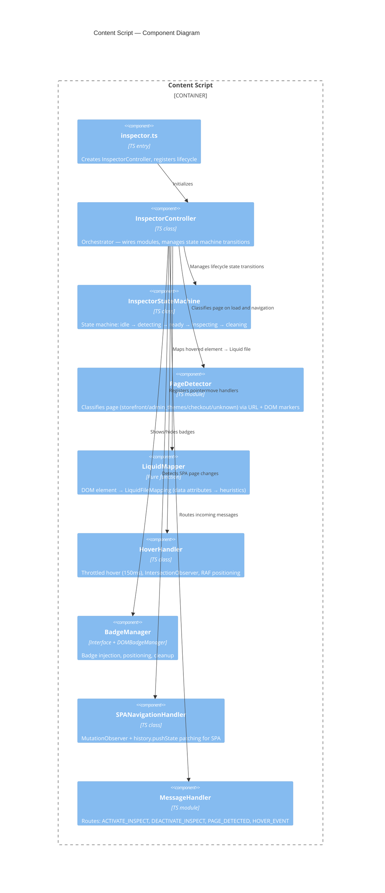
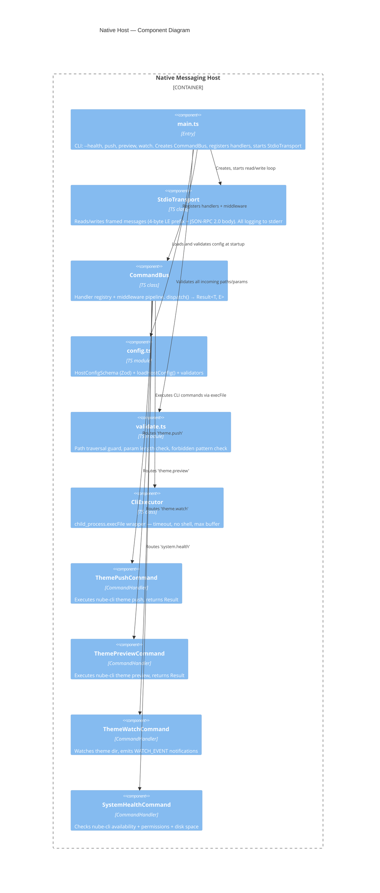

# C4 Component Diagram — Components

**Change**: `scaffold`
**Phase**: design
**Date**: 2026-07-16
**Traceability**: Spec 00 FR-ARCH-001..008, Spec 03, Spec 04, Spec 05, Spec 06

---

## Background Service Worker (Adapter)

## DevTools Panel (Adapter)

## Content Script (Adapter)

## Native Host (Adapter)

