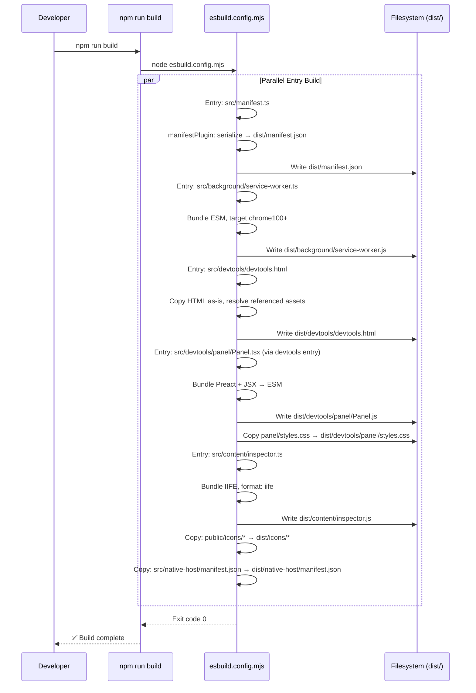
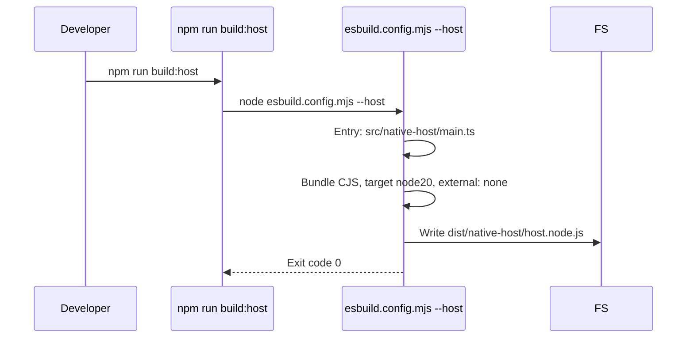
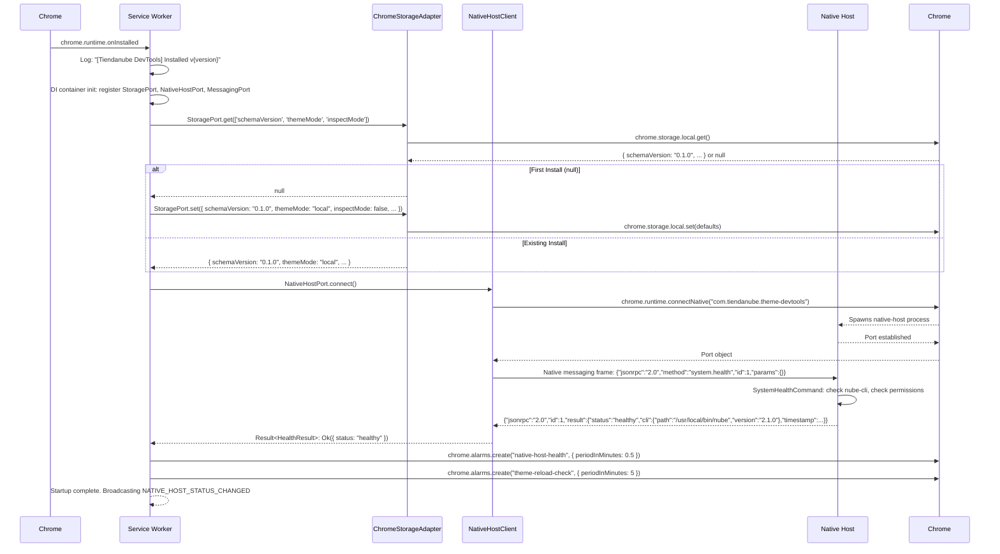
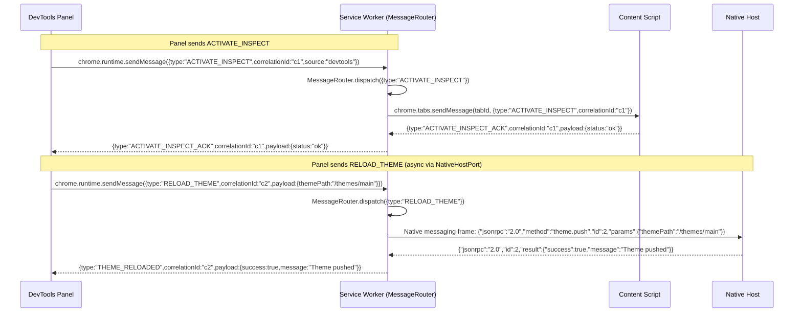
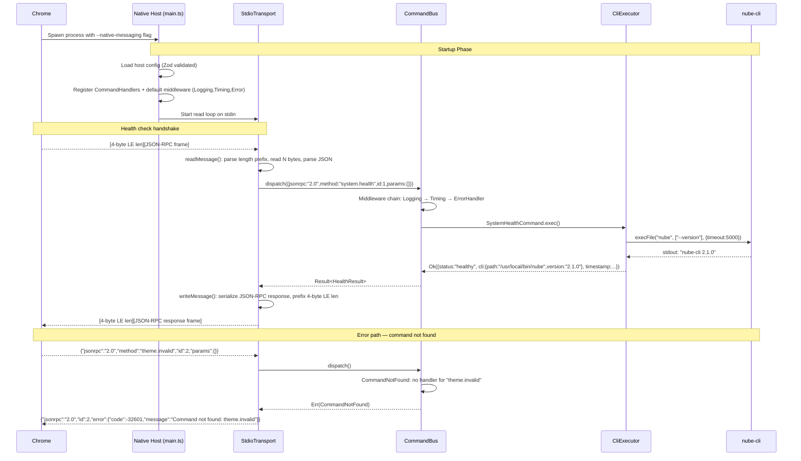
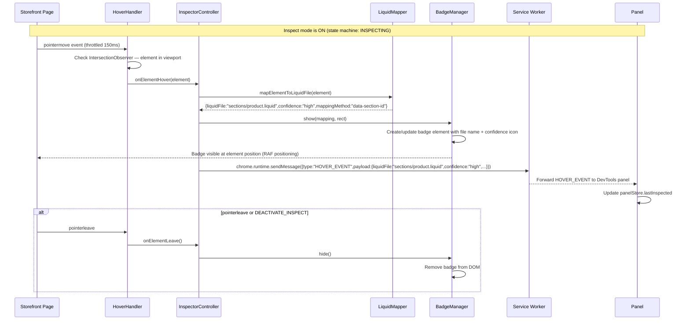
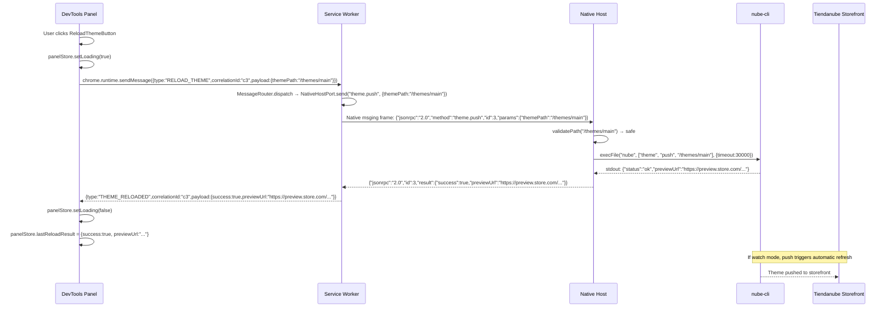

# Sequence Diagrams

**Change**: `scaffold`
**Phase**: design
**Date**: 2026-07-16
**Traceability**: Spec 01 FR-CONF-001..005, Spec 03 FR-BG-001..006, Spec 04 FR-DTP-001..009, Spec 05 FR-CI-001..006, Spec 06 FR-NH-001..006

---

## 1. Build Pipeline (esbuild Multi-Entry)

**Build:Host** (separate pass):

---

## 2. Extension Startup (SW Install → Storage Init → Native Host Connect → Health Alarm)

---

## 3. Messaging Flow (Panel → Background → Content / Native Host)

**Key**: Every message carries `correlationId` (UUIDv4) for request/response matching. Timeout after 30s → `Err(MessageTimeout)`.

---

## 4. Native Host Handshake (JSON-RPC 2.0 over stdio)

---

## 5. Inspect Mode Activation (Hover → LiquidMapper → BadgeManager → Panel)

---

## 6. Theme Reload (Panel → Background → Native Host → nube-cli → Watch Event → Panel)

