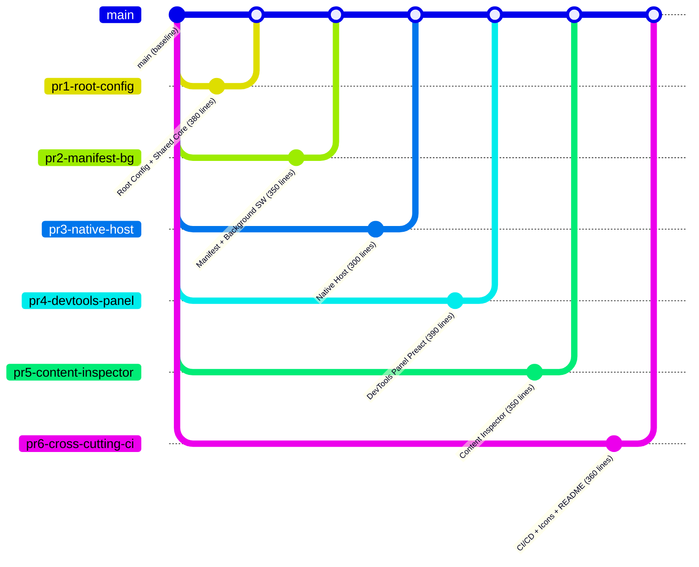

# Deployment Architecture

**Change**: `scaffold`
**Phase**: design
**Date**: 2026-07-16
**Traceability**: Spec 09 (all ACs), Spec 10 (delivery plan), Spec 01 FR-CONF-005, Spec 08 FR-CC-06

---

## 1. PR Strategy: Feature-Branch Chain (Stacked-to-Main)

Per Spec 10, the scaffold change is split into **6 stacked PRs** to stay within the 400-line review budget.



### PR Dependencies

| PR | Depends On | Est. Lines | Must Merge Before |
|----|-----------|------------|-------------------|
| PR #1: Root Config + Shared Core | — (base) | ~380 | PR #2, PR #3 |
| PR #2: Manifest + Background SW | PR #1 | ~350 | PR #4 |
| PR #3: Native Host | PR #1 | ~300 | PR #4 |
| PR #4: DevTools Panel | PR #1, PR #2, PR #3 | ~390 | PR #5 |
| PR #5: Content Inspector | PR #1, PR #2, PR #4 | ~350 | PR #6 |
| PR #6: Cross-Cutting + CI/CD | PR #1-5 | ~360 | — (final) |

**Total**: ~2,130 lines | ~59 files | 6 stacked PRs

---

## 2. CI Pipeline

```mermaid
flowchart LR
  A[Push to PR branch] --> B[Lint]
  B --> C[TypeCheck]
  C --> D[Test]
  D --> E[Build]
  E --> F[Zip]
  F --> G[Bundle Size Check]
  G --> H[CSP Validation]
  H --> I[Merge Gate]

  B -.-> J[eslint src/]
  C -.-> K[tsc --noEmit extension + native-host]
  D -.-> L[vitest run --coverage]
  E -.-> M[npm run build + build:host]
  F -.-> N[node scripts/build-zip.mjs]
  G -.-> O["SW ≤15KB | Panel ≤50KB | Content ≤10KB | Host ≤8MB"]
  H -.-> P["No 'unsafe-inline' in manifest.js"]
  I -.-> Q["All checks pass + 2 approvals (SDD)")
```

### CI Stages (`.github/workflows/ci.yml`)

| Stage | Command | Timeout | Gate |
|-------|---------|---------|------|
| **Lint** | `eslint src/ --max-warnings 0` | 2m | No warnings |
| **TypeCheck** | `tsc --noEmit -p tsconfig.extension.json -p tsconfig.native-host.json` | 2m | Zero errors |
| **Test** | `vitest run --coverage` | 3m | Lines ≥80%, Functions ≥80%, Branches ≥70%, Stmts ≥80% |
| **Build** | `npm run build && npm run build:host` | 1m | Exit code 0 |
| **Zip** | `node scripts/build-zip.mjs` | 30s | `dist/extension.zip` exists with `manifest.json` |
| **Bundle Size** | Custom check | 10s | SW ≤15KB, Panel ≤50KB, Content ≤10KB, Host ≤8MB |
| **CSP** | Grep `dist/manifest.json` for `unsafe-inline` | 5s | No matches |
| **Deps** | `madge --circular src/` | 30s | No circular deps |

### `.github/dependabot.yml`

```yaml
version: 2
updates:
  - package-ecosystem: "npm"
    directory: "/"
    schedule:
      interval: "weekly"
      day: "monday"
    labels:
      - "dependencies"
    open-pull-requests-limit: 5
```

---

## 3. Release Workflow

```mermaid
flowchart LR
  A[Feature branch PR merged] --> B[CI passes on main]
  B --> C[Git tag v*]
  C --> D[Build artifacts]
  D --> E[dist/extension.zip]
  D --> F[dist/native-host/host.node.js]
  E --> G[Upload to Chrome Web Store]
  F --> H[Package for distribution (SEA deferred)]
```

### Versioning

- Follows `major.minor.patch` from `package.json`
- Manifest version auto-synced via `manifestPlugin`
- Tags: `git tag v0.1.0 && git push --tags`

### Artifacts Per Release

| Artifact | Source | Distribution |
|----------|--------|--------------|
| `dist/extension.zip` | `npm run build && npm run zip` | Chrome Web Store |
| `dist/native-host/host.node.js` | `npm run build:host` | SEA packaging (deferred) |

### Chrome Web Store Checklist

- [ ] Extension loads in Chrome unpacked from `dist/`
- [ ] `dist/extension.zip` uploads to CWS without validation errors
- [ ] DevTools panel tab renders
- [ ] Permissions screen shows expected list only

---

## 4. Native Host Installation

Native host is installed separately from the extension:

```bash
# macOS / Linux
cp dist/native-host/manifest.json ~/Library/Application Support/Google/Chrome/NativeMessagingHosts/
cp dist/native-host/host.node.js ~/tiendanube-devtools/

# Windows (via installer script, deferred)
reg add "HKCU\Software\Google\Chrome\NativeMessagingHosts\com.tiendanube.theme-devtools" /ve /t REG_SZ /d "%APPDATA%\Tiendanube\devtools\native-host-manifest.json"
```

**Note**: SEA (Single Executable Application) packaging for the native host is deferred. Initial releases run via Node.js directly.

---

## 5. Environment Variables

| Variable | Used By | Purpose | Required |
|----------|---------|---------|----------|
| `NUBE_CLI_PATH` | Native Host | Explicit path to nube-cli binary | Optional |
| `NODE_ENV` | esbuild | `production` strips dev manifest keys | Optional |
| `DEBUG` | Native Host | Enables debug logging | Optional |

All environment variables documented in `.env.example`.
