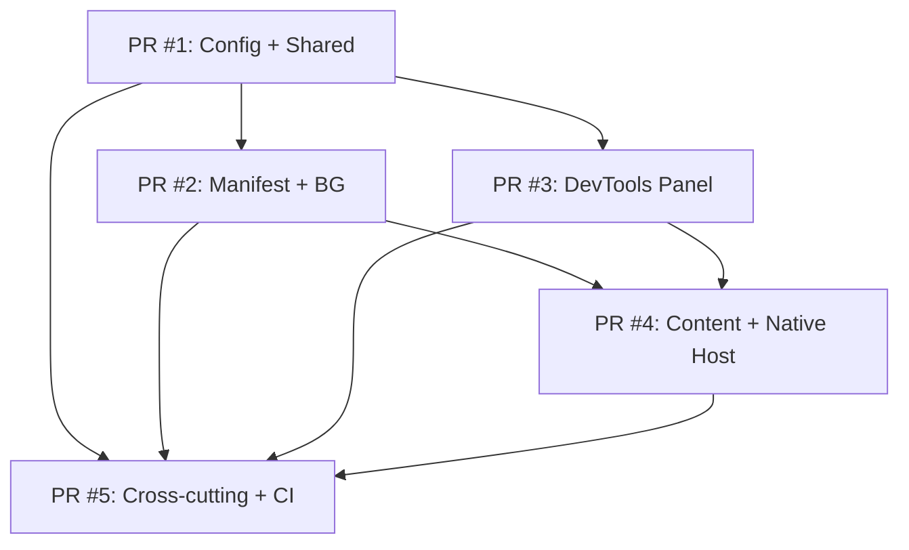

# Spec: Delivery Plan — Stacked-to-Main PRs

**Change**: `scaffold` | **Phase**: `spec` | **Version**: 1.0

---

## Overview

The `scaffold` change delivers ~1,500 lines across ~50 files. Per SDD review budget (400 lines) and delivery strategy (`force-chained` / `stacked-to-main`), this is split into **5 stacked PRs** merged sequentially to `main`.

| PR | Scope | Est. Lines | Files | Depends On |
|----|-------|------------|-------|------------|
| **PR #1** | Root Config + Shared Core | ~380 | 12 | — (base) |
| **PR #2** | Manifest + Background SW | ~350 | 8 | PR #1 |
| **PR #3** | DevTools Panel (Preact) | ~390 | 15 | PR #1 |
| **PR #4** | Content Inspector + Native Host | ~370 | 10 | PR #1, PR #2 |
| **PR #5** | Cross-Cutting + CI/CD + Zip + Icons + README | ~360 | 8 | PR #1-4 |

**Total**: ~1,850 lines | ~53 files | 5 PRs

---

## PR #1: Root Config + Shared Core

### Goal
Establish tooling, build pipeline, and shared domain layer. After merge: `npm install && npm run build` works (produces empty `dist/`).

### Files Created
| Path | Purpose | Est. Lines |
|------|---------|------------|
| `package.json` | Workspace root + scripts + deps | 55 |
| `tsconfig.json` | Project references root | 25 |
| `tsconfig.extension.json` | Extension layer TS config | 30 |
| `tsconfig.native-host.json` | Native host TS config | 25 |
| `esbuild.config.mjs` | Multi-entry build (4 entry points) | 80 |
| `vitest.config.ts` | Test config (jsdom + node) | 35 |
| `.eslintrc.cjs` | ESLint + TypeScript + Preact | 45 |
| `.prettierrc` / `.prettierignore` | Formatting | 15 |
| `src/shared/result.ts` | Result/Either pattern | 45 |
| `src/shared/errors.ts` | DomainError discriminated union | 50 |
| `src/shared/messaging.ts` | Envelope, Request, Response types | 55 |
| `src/shared/di.ts` | Lightweight DI container | 50 |
| `src/shared/logger.ts` | Logger interface + ConsoleLogger | 40 |
| `src/shared/ports/StoragePort.ts` | Port interface | 15 |
| `src/shared/ports/MessagingPort.ts` | Port interface | 15 |
| `src/shared/ports/NativeHostPort.ts` | Port interface | 15 |
| `src/shared/types/chrome.d.ts` | Chrome API augmentations | 25 |
| `src/shared/utils.ts` | Pure utilities (debounce, uuid, etc.) | 60 |
| `src/types/global.d.ts` | Global type declarations | 10 |

### Acceptance Criteria (from 09-acceptance-criteria.md)
- AC-RC-01..08, AC-SH-01..04, AC-CC-01..03

### CI Gates (must pass before PR #2 can be reviewed)
```yaml
jobs:
  lint: eslint src/
  typecheck: tsc --noEmit -p tsconfig.extension.json -p tsconfig.native-host.json
  test: vitest run
  build: npm run build  # produces dist/ (empty but valid)
```

### Validation
```bash
npm ci && npm run build  # dist/manifest.json, dist/background/, dist/devtools/, dist/content/
npm run typecheck        # 0 errors
npm run lint             # 0 warnings
npm run test             # skeleton tests pass
```

---

## PR #1: Root Config + Shared Core

### Goal
Establish tooling, build pipeline, and shared domain layer. After merge: `npm install && npm run build` works (produces empty `dist/`).

### Files Created
| Path | Purpose | Est. Lines |
|------|---------|------------|
| `package.json` | Workspace root + scripts + deps | 55 |
| `tsconfig.json` | Project references root | 25 |
| `tsconfig.extension.json` | Extension layer TS config | 30 |
| `tsconfig.native-host.json` | Native host TS config | 25 |
| `esbuild.config.mjs` | Multi-entry build (4 entry points) | 80 |
| `vitest.config.ts` | Test config (jsdom + node) | 35 |
| `vitest.native-host.config.ts` | Native host test config (Node) | 25 |
| `vitest.setup.ts` | Chrome API mocks (storage, runtime, devtools) | 45 |
| `vitest.native-host.setup.ts` | Native host test setup (Node) | 15 |
| `.eslintrc.cjs` | ESLint + TypeScript + Preact | 45 |
| `.prettierrc` / `.prettierignore` | Formatting | 15 |
| `src/shared/result.ts` | Result/Either pattern | 45 |
| `src/shared/errors.ts` | DomainError discriminated union | 50 |
| `src/shared/messaging.ts` | Envelope, Request, Response types | 55 |
| `src/shared/di.ts` | Lightweight DI container | 50 |
| `src/shared/logger.ts` | Logger interface + ConsoleLogger | 40 |
| `src/shared/ports/StoragePort.ts` | Port interface | 15 |
| `src/shared/ports/MessagingPort.ts` | Port interface | 15 |
| `src/shared/ports/NativeHostPort.ts` | Port interface | 15 |
| `src/shared/types/chrome.d.ts` | Chrome API augmentations | 25 |
| `src/shared/utils.ts` | Pure utilities (debounce, uuid, etc.) | 60 |
| `src/types/global.d.ts` | Global type declarations | 10 |

### Acceptance Criteria (from 09-acceptance-criteria.md)
- AC-RC-01..08, AC-SH-01..04, AC-CC-01..03

### CI Gates (must pass before PR #2 can be reviewed)
```yaml
jobs:
  lint: eslint src/
  typecheck: tsc --noEmit -p tsconfig.extension.json -p tsconfig.native-host.json
  test: vitest run
  build: npm run build  # produces dist/ (empty but valid)
```

### Validation
```bash
npm ci && npm run build  # dist/manifest.json, dist/background/, dist/devtools/, dist/content/
npm run typecheck        # 0 errors
npm run lint             # 0 warnings
npm run test             # skeleton tests pass
```

---

## Cross-Adapter Integration Tests (New Section)

### Goal
Ensure end-to-end message flows work across all adapters: Panel → Background → Native Host → Background → Panel, and Panel → Background → Content Script.

### Files Created (added to PR #5 scope)
| Path | Purpose | Est. Lines |
|------|---------|------------|
| `tests/integration/panel-bg-native.test.ts` | Panel → BG → Native Host round-trip | 60 |
| `tests/integration/panel-bg-content.test.ts` | Panel → BG → Content Script flow | 50 |
| `tests/integration/storage-sync.test.ts` | Storage sync across adapters | 40 |
| `tests/e2e/panel-load.test.ts` | Playwright: panel loads in Chrome | 35 |
| `tests/e2e/theme-reload.test.ts` | Playwright: reload theme flow | 45 |
| `tests/e2e/inspect-mode.test.ts` | Playwright: inspect mode flow | 45 |
| `playwright.config.ts` | Playwright config (Chrome extension) | 30 |

### Test Scenarios

| Test ID | Type | Description |
|---------|------|-------------|
| IT-001 | Integration | Panel sends RELOAD_THEME → BG → Native Host → BG → Panel status updates |
| IT-002 | Integration | Panel sends SET_MODE → BG → Storage → Content script receives |
| IT-003 | Integration | Native host health check → BG → Panel status bar updates |
| IT-004 | Integration | Content script hover → Badge injected → Panel status updates |
| E2E-001 | E2E | Extension loads, DevTools panel renders, status bar shows "Not connected" |
| E2E-002 | E2E | Click Reload Theme → Native host executes → Status shows success |
| E2E-003 | E2E | Enable Inspect Mode → Hover element → Badge shows Liquid file name |

### Playwright Config (Chrome Extension)

```typescript
// playwright.config.ts
import { defineConfig, devices } from '@playwright/test';

export default defineConfig({
  testDir: './tests/e2e',
  fullyParallel: true,
  retries: 2,
  workers: 1,
  use: {
    baseURL: 'https://tiendanube.com',
    trace: 'on-first-retry',
    screenshot: 'only-on-failure',
  },
  projects: [
    {
      name: 'chromium-extension',
      use: {
        ...devices['Desktop Chrome'],
        launchOptions: {
          args: [
            '--disable-extensions-except=/path/to/extension',
            '--load-extension=/path/to/extension',
            '--no-first-run',
            '--no-default-browser-check',
          ],
        },
      },
    },
  ],
  webServer: {
    command: 'npm run dev:storefront', // or use live store
    url: 'https://tiendanube.com',
    reuseExistingServer: true,
  },
});
```

---

## PR #2: Manifest + Background Service Worker

### Goal
Generate valid Manifest V3, register Service Worker, implement message routing and native host client.

### Files Created
| Path | Purpose | Est. Lines |
|------|---------|------------|
| `src/manifest.ts` | Typed manifest definition (generates manifest.json) | 70 |
| `src/shared/types/manifest.ts` | `defineManifest()` helper + types | 30 |
| `src/background/service-worker.ts` | SW entry: router, alarms, native host client | 120 |
| `src/background/MessageRouter.ts` | Routes messages between panel/content/native | 80 |
| `src/background/NativeHostClient.ts` | Adapter for NativeHostPort (stdio JSON-RPC) | 75 |
| `src/background/ChromeStorageAdapter.ts` | Adapter for StoragePort | 35 |
| `src/background/alarms.ts` | Theme reload check alarm | 25 |
| `src/native-host/manifest.json` | Native messaging host manifest | 15 |

### Acceptance Criteria
- AC-MF-01..08, AC-BG-01..07

### CI Gates (extends PR #1)
- Same + `npm run build` now produces full `dist/` with:
  - `dist/manifest.json` (valid MV3)
  - `dist/background/service-worker.js`
  - `dist/native-host/manifest.json` (copied)

### Validation
```bash
# In Chrome: Load unpacked dist/
# chrome://extensions → service worker console: "SW started", "Native host client connected"
# chrome.runtime.sendMessage({ type: 'health' }) → { ok: true }
```

---

## PR #3: DevTools Panel (Preact)

### Goal
Register DevTools panel, render Preact UI with stub components for: Local/Remote toggle, Reload Theme button, Inspect Mode toggle, Status Bar. **Global reactive store with Preact Signals for shared panel state.**

### Files Created
| Path | Purpose | Est. Lines |
|------|---------|------------|
| `src/devtools/devtools.html` | Panel HTML entry | 20 |
| `src/devtools/devtools.ts` | `chrome.devtools.panels.create()` registration | 25 |
| `src/devtools/panel/Panel.tsx` | Root Preact component (layout) | 50 |
| `src/devtools/panel/App.tsx` | Main app with state + message hooks | 60 |
| `src/devtools/panel/store/panelStore.ts` | **Global reactive store (Preact Signals)** | 45 |
| `src/devtools/panel/components/LocalRemoteToggle.tsx` | Toggle + message to background | 35 |
| `src/devtools/panel/components/ReloadThemeButton.tsx` | Button + loading state | 35 |
| `src/devtools/panel/components/InspectModeToggle.tsx` | Toggle + content script activation | 35 |
| `src/devtools/panel/components/StatusBar.tsx` | Connection state + version | 25 |
| `src/devtools/panel/components/ErrorBoundary.tsx` | Preact error boundary | 20 |
| `src/devtools/panel/hooks/useChromeRuntime.ts` | `chrome.runtime.sendMessage` wrapper | 30 |
| `src/devtools/panel/hooks/useConnectionState.ts` | Background connection state | 25 |
| `src/devtools/panel/hooks/useNativeHostStatus.ts` | Native host health polling | 20 |
| `src/devtools/panel/styles.css` | Panel styling (CSP-compliant) | 40 |
| `src/devtools/panel/styles.module.css` | CSS Modules for components | 25 |
| `src/devtools/panel/types.ts` | Panel-specific types | 15 |

### Acceptance Criteria
- AC-DP-01..07, **AC-DP-09-01..07** (panel store)

### CI Gates (extends PR #1-2)
- Build produces `dist/devtools/devtools.html`, `dist/devtools/panel/*.js`
- Panel bundle ≤ 50 KB gzipped

### Validation
```bash
# In Chrome: Open DevTools on any page → "🛠 Tienda Nube" tab appears
# UI renders: toggles, button, status bar (all stubbed)
# Console: no CSP violations, no errors
```

---

## PR #4: Content Inspector + Native Host

### Goal
Content script detects Tiendanube pages, hover → badge with Liquid file name. Native host binary executes `nube-cli` commands.

### Files Created
| Path | Purpose | Est. Lines |
|------|---------|------------|
| `src/content/inspector.ts` | Content script entry + hover logic | 80 |
| `src/content/LiquidFileDetector.ts` | Heuristics for Liquid file names | 50 |
| `src/content/BadgeManager.ts` | Badge DOM injection + cleanup | 45 |
| `src/content/Throttle.ts` | 150ms debounce utility | 15 |
| `src/native-host/main.ts` | CLI entry: health, push, preview, watch | 90 |
| `src/native-host/CommandDispatcher.ts` | JSON-RPC 2.0 dispatch | 40 |
| `src/native-host/NubeCliExecutor.ts` | Spawns nube-cli, timeout, parsing | 50 |
| `src/native-host/StdioTransport.ts` | stdin/stdout JSON-RPC framing | 35 |
| `src/native-host/FileStorageAdapter.ts` | StoragePort adapter (file-based) | 25 |
| `src/native-host/package.json` | Native host deps (minimal) | 15 |

### Acceptance Criteria
- AC-CI-01..06, AC-NH-01..07

### CI Gates (extends PR #1-3)
- Build produces `dist/content/inspector.js`, `dist/native-host/host.node.js`
- Native host binary via `npm run build:host`

### Validation
```bash
# Content: Open Tiendanube storefront → enable Inspect Mode → hover product card
# Badge appears: "snippets/product-card.liquid" (or heuristic match)
# Disable → badge removed, no DOM leaks

# Native Host:
node dist/native-host/host.node.js --health
# { "status": "ok", "version": "0.1.0" }

node dist/native-host/host.node.js push --theme-id 123
# Executes nube-cli theme push, returns structured result
```

---

## PR #5: Cross-Cutting + CI/CD + Zip + Icons + README

### Goal
Wire cross-cutting concerns (Result pattern enforcement, DI wiring, logging, CSP), full CI pipeline, Chrome Web Store zip, icons, updated docs.

### Files Created
| Path | Purpose | Est. Lines |
|------|---------|------------|
| `src/shared/storage.ts` | Chrome storage wrapper (Result-based) | 45 |
| `src/background/ConsoleLogger.ts` | Logger transport (background) | 20 |
| `src/devtools/panel/ConsoleLogger.ts` | Logger transport (panel) | 20 |
| `src/native-host/FileLogger.ts` | Logger transport (native host) | 25 |
| `.github/workflows/ci.yml` | Full CI: lint, typecheck, test, build, zip | 80 |
| `.github/dependabot.yml` | Weekly dependency updates | 15 |
| `scripts/build-zip.mjs` | Creates `dist/extension.zip` | 55 |
| `public/icons/icon16.png`, `icon48.png`, `icon128.png` | Placeholder icons | (binary) |
| `README.md` | Updated with dev commands | 40 |

### Acceptance Criteria
- AC-CC-01..06, AC-RC-06, AC-CC-05..06

### CI Pipeline (`.github/workflows/ci.yml`)
```yaml
name: CI
on: [push, pull_request]
jobs:
  lint:
    runs-on: ubuntu-latest
    steps:
      - uses: actions/checkout@v4
      - uses: actions/setup-node@v4
        with: { node-version: '20', cache: 'npm' }
      - run: npm ci
      - run: npm run lint

  typecheck:
    runs-on: ubuntu-latest
    steps:
      - uses: actions/checkout@v4
      - uses: actions/setup-node@v4
        with: { node-version: '20', cache: 'npm' }
      - run: npm ci
      - run: npm run typecheck

  test:
    runs-on: ubuntu-latest
    steps:
      - uses: actions/checkout@v4
      - uses: actions/setup-node@v4
        with: { node-version: '20', cache: 'npm' }
      - run: npm ci
      - run: npm run test

  build:
    runs-on: ubuntu-latest
    needs: [lint, typecheck, test]
    steps:
      - uses: actions/checkout@v4
      - uses: actions/setup-node@v4
        with: { node-version: '20', cache: 'npm' }
      - run: npm ci
      - run: npm run build
      - run: npm run zip
      - uses: actions/upload-artifact@v4
        with: { name: extension-zip, path: dist/extension.zip }

  # Optional: Lighthouse CI for panel cold mount
  # Optional: Native host binary test on macOS/Windows runners
```

### Validation (Post-Merge)
```bash
# 1. Fresh clone
git clone https://github.com/mauroociappinaph/tiendanube-theme-devtools.git
cd tiendanube-theme-devtools

# 2. Install & build
npm ci && npm run build && npm run zip

# 3. Load in Chrome
# chrome://extensions → Load unpacked → dist/
# Verify: Service worker, DevTools panel, Content script, Native host

# 4. Upload zip to CWS (developer dashboard) → validation passes
```

---

## Merge Order & Dependencies



### Sequential Merge Rules
1. Each PR merged to `main` only after CI passes
2. Next PR rebased on `main` before review
3. No parallel merges (stacked-to-main)
4. Tag `v0.1.0-scaffold` after PR #5 merged

---

## Rollback Plan

If any PR breaks `main`:
1. `git revert <merge-commit>` on `main`
2. CI re-runs on reverted state (should pass)
3. Fix on feature branch, re-open PR
4. No database migrations, no data loss — purely additive files

---

## Policy Enforcement in Delivery

### FR-POL-001 to FR-POL-021 Compliance

Each PR MUST validate against project policies before merge:

| Policy | Validation Point | PR |
|--------|------------------|----|
| FR-POL-001: Git Flow Branching | Branch naming + no direct push to main/develop | All |
| FR-POL-002: Conventional Commits | `commitlint --strict` on PR commits | All |
| FR-POL-003: PR Required | PR to develop/main required | All |
| FR-POL-004: Workflow Files | `.github/workflows/*.yml` exist | PR #1, #5 |
| FR-POL-005: Branch Protection | Configured via GitHub API | Post-merge |
| FR-POL-006: CodeRabbit | PR review automation | All |
| FR-POL-007: Dependabot | Weekly config present | PR #5 |
| FR-POL-008: SemVer Tagging | Tag format `vX.Y.Z` | PR #5 (release) |
| FR-POL-009: Changelog | `standard-version` output | PR #5 |
| FR-POL-010: GitHub Release | Artifacts uploaded | PR #5 |
| FR-POL-011: Env Strategy | `.env.example` exists | PR #1 |
| FR-POL-012: Chrome MV3 Security | Manifest perms minimal | PR #2 |
| FR-POL-013: Native Host Security | Native host only accesses secrets | PR #4 |
| FR-POL-014: GH Actions Secrets | Release workflow uses secrets | PR #5 |
| FR-POL-015: Env Validation | `validate:env` script runs | PR #5 |
| FR-POL-016: Chrome Permissions | Minimal perms in manifest | PR #2 |
| FR-POL-017: README Updates | README.md updated per PR | All |
| FR-POL-018: ADR | New deps/patterns documented | PR #1, #2, #4 |
| FR-POL-019: Quality Gates | All CI gates pass | All |
| FR-POL-020: Agent Self-Eval | PR template filled | All |
| FR-POL-021: SDD Artifact Validation | Filesystem check | Each phase |

### Quality Gates Per PR (All Must Pass)

| Gate | Tool | Threshold |
|------|------|-----------|
| TypeScript strict | `tsc --noEmit` | 0 errors |
| Linting | `eslint src/` | 0 errors, 0 warnings |
| Formatting | `prettier --check` | 0 diffs |
| Unit tests | `vitest run` | 100% pass |
| Integration tests | `vitest run --integration` | 100% pass |
| Build | `npm run build` | Success + artifacts |
| Architecture validation | `madge --circular` | 0 cycles |
| Dependency audit | `npm audit --audit-level=high` | 0 high/critical |
| Automated code review | CodeRabbit | No blocking findings |
| Security validation | `npm audit` + manual | 0 critical |

---

## CI/CD Pipeline Integration

### PR #1: Adds `ci.yml` + `lint.yml` + `typecheck.yml` + `test.yml`
```yaml
# .github/workflows/ci.yml (simplified)
name: CI
on: [push, pull_request]
jobs:
  lint:
    runs-on: ubuntu-latest
    steps:
      - uses: actions/checkout@v4
      - uses: actions/setup-node@v4
        with: { node-version: '20', cache: 'npm' }
      - run: npm ci
      - run: npm run lint

  typecheck:
    runs-on: ubuntu-latest
    steps:
      - uses: actions/checkout@v4
      - uses: actions/setup-node@v4
        with: { node-version: '20', cache: 'npm' }
      - run: npm ci
      - run: npm run typecheck

  test:
    runs-on: ubuntu-latest
    steps:
      - uses: actions/checkout@v4
      - uses: actions/setup-node@v4
        with: { node-version: '20', cache: 'npm' }
      - run: npm ci
      - run: npm run test

  build:
    needs: [lint, typecheck, test]
    runs-on: ubuntu-latest
    steps:
      - uses: actions/checkout@v4
      - uses: actions/setup-node@v4
        with: { node-version: '20', cache: 'npm' }
      - run: npm ci
      - run: npm run build
      - run: npm run zip
      - uses: actions/upload-artifact@v4
        with: { name: extension-zip, path: dist/extension.zip }
```

### PR #5: Adds `release.yml` + `dependency.yml` + `build.yml`
```yaml
# .github/workflows/release.yml
name: Release
on:
  workflow_dispatch:
    inputs:
      version:
        type: choice
        options: [patch, minor, major]
      dry-run:
        type: boolean
        default: true
jobs:
  release:
    runs-on: ubuntu-latest
    if: github.ref == 'refs/heads/main'
    steps:
      - uses: actions/checkout@v4
        with: { fetch-depth: 0 }
      - uses: actions/setup-node@v4
        with: { node-version: '20', cache: 'npm' }
      - run: npm ci
      - run: npm run validate:env
      - run: npm run build && npm run zip
      - uses: release-it/gh-actions@v1
        with:
          release-it: |
            standard-version --release-as ${{ inputs.version }} --dry-run=${{ inputs.dry-run }}
      - uses: actions/upload-artifact@v4
        with:
          name: release-artifacts
          path: dist/
```

### Native Host Cross-Compilation (PR #5)

```yaml
# .github/workflows/build-native.yml
name: Build Native Host
on: [push, pull_request]
jobs:
  build-native:
    runs-on: ${{ matrix.os }}
    strategy:
      matrix:
        os: [ubuntu-latest, macos-latest, windows-latest]
    steps:
      - uses: actions/checkout@v4
      - uses: actions/setup-node@v4
        with: { node-version: '20', cache: 'npm' }
      - run: npm ci
      - run: npm run build:host
      - uses: actions/upload-artifact@v4
        with:
          name: native-host-${{ matrix.os }}
          path: dist/native-host/
```

---

## PR-Specific Policy Checklist

### PR #1: Root Config + Shared Core
- [ ] `package.json` with all scripts, deps, workspaces
- [ ] `tsconfig.json` + project references (3 layers)
- [ ] `esbuild.config.mjs` with 4 entry points
- [ ] `.eslintrc.cjs` + `.prettierrc` + `vitest.config.ts`
- [ ] `src/shared/` — result, errors, messaging, di, logger, ports, types, utils
- [ ] `.env.example` (FR-POL-011)
- [ ] ADR for build tool choice (FR-POL-018)
- [ ] CI: `lint.yml`, `typecheck.yml`, `test.yml` (FR-POL-004)
- [ ] Quality gates pass (FR-POL-019)

### PR #2: Manifest + Background SW
- [ ] `src/manifest.ts` → `manifest.json` (minimal perms FR-POL-016)
- [ ] `src/background/service-worker.ts` + router, native host client
- [ ] `src/background/NativeHostClient.ts` (port interface)
- [ ] `src/background/ChromeStorageAdapter.ts`
- [ ] `src/background/alarms.ts`
- [ ] `src/native-host/manifest.json`
- [ ] ADR for security model (FR-POL-018)

### PR #3: DevTools Panel (Preact)
- [ ] `src/devtools/devtools.html` + `devtools.ts`
- [ ] `src/devtools/panel/Panel.tsx` + `App.tsx`
- [ ] Components: `LocalRemoteToggle`, `ReloadThemeButton`, `InspectModeToggle`, `StatusBar`, `ErrorBoundary`
- [ ] Hooks: `useChromeRuntime`, `useConnectionState`, `useNativeHostStatus`
- [ ] `styles.css` + CSS Modules (CSP compliant)
- [ ] CSP: no inline styles in production

### PR #4: Content Inspector + Native Host
- [ ] `src/content/inspector.ts` + `LiquidFileDetector`, `BadgeManager`, `Throttle`
- [ ] `src/native-host/main.ts` + `CommandDispatcher`, `NubeCliExecutor`, `StdioTransport`, `FileStorageAdapter`
- [ ] `src/native-host/package.json`
- [ ] Native host security (FR-POL-013)
- [ ] ADR for native host path discovery (FR-POL-018)

### PR #5: Cross-Cutting + CI/CD + Zip + Icons + README
- [ ] `src/shared/storage.ts` (Result-based chrome.storage wrapper)
- [ ] Logger transports: `ConsoleLogger` (bg/panel/content), `FileLogger` (native)
- [ ] CI: `build.yml` + `release.yml` + `dependency.yml` + `build-native.yml`
- [ ] `scripts/build-zip.mjs` → `dist/extension.zip`
- [ ] `public/icons/icon16.png`, `icon48.png`, `icon128.png`
- [ ] `README.md` updated (FR-POL-017)
- [ ] `scripts/validate-env.ts` (FR-POL-015)
- [ ] GitHub Release workflow with artifacts (FR-POL-010)
- [ ] Dependabot config (FR-POL-007)
- [ ] Tag `v0.1.0-scaffold` after merge

---

*End of Delivery Plan Spec*