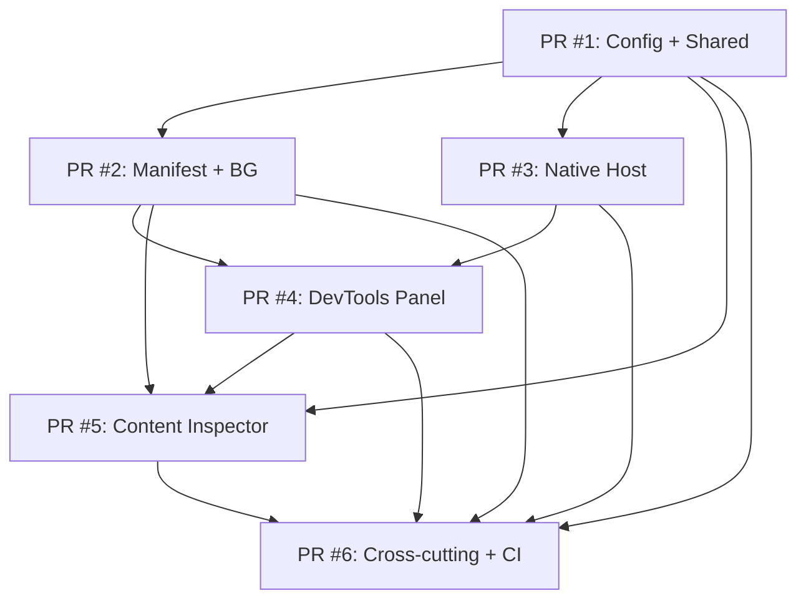

# Spec: Delivery Plan — Stacked-to-Main PRs

**Change**: `scaffold` | **Phase**: `spec` | **Version**: 1.0

---

## Overview

The `scaffold` change delivers ~2,130 lines across ~59 files. Per SDD review budget (400 lines) and delivery strategy (`force-chained` / `stacked-to-main`), this is split into **6 stacked PRs** merged sequentially to `main`.

| PR | Scope | Est. Lines | Files | Depends On |
|----|-------|------------|-------|------------|
| **PR #1** | Root Config + Shared Core | ~380 | 12 | — (base) |
| **PR #2** | Manifest + Background SW | ~350 | 8 | PR #1 |
| **PR #3** | Native Host | ~300 | 6 | PR #1 |
| **PR #4** | DevTools Panel (Preact) | ~390 | 15 | PR #1, PR #2, PR #3 |
| **PR #5** | Content Inspector | ~350 | 10 | PR #1, PR #2, PR #4 |
| **PR #6** | Cross-Cutting + CI/CD + Zip + Icons + README | ~360 | 8 | PR #1-5 |

**Total**: ~2,130 lines | ~59 files | 6 PRs

---

## PR Tracking — Status | Owner | Coverage

| PR | Scope | Status | Owner | Coverage (unit/int) | DoR ✅ | DoD ✅ |
|----|-------|--------|-------|---------------------|--------|--------|
| #1 | Root Config + Shared Core | Not Started | @backend-lead | — / — | ☐ | ☐ |
| #2 | Manifest + Background SW | Not Started | @backend-lead | — / — | ☐ | ☐ |
| #3 | Native Host | Not Started | @fullstack-lead | — / — | ☐ | ☐ |
| #4 | DevTools Panel (Preact) | Not Started | @frontend-lead | — / — | ☐ | ☐ |
| #5 | Content Inspector | Not Started | @frontend-lead | — / — | ☐ | ☐ |
| #6 | Cross-Cutting + CI/CD + Zip | Not Started | @devops-lead | — / — | ☐ | ☐ |

### Sub-tasks PR #1 (granular tracking)

| Task | Status | Owner | Coverage | DoR ✅ | DoD ✅ |
|------|--------|-------|----------|--------|--------|
| package.json + scripts | Not Started | @backend-lead | 80/80/70/80 | ☐ | ☐ |
| tsconfig (project refs) | Not Started | @backend-lead | 80/80/70/80 | ☐ | ☐ |
| esbuild.config.mjs | Not Started | @backend-lead | 80/80/70/80 | ☐ | ☐ |
| vitest.config.ts + setup | Not Started | @backend-lead | 80/80/70/80 | ☐ | ☐ |
| eslint + prettier | Not Started | @backend-lead | 80/80/70/80 | ☐ | ☐ |
| shared/result.ts + tests | Not Started | @backend-lead | 80/80/70/80 | ☐ | ☐ |
| shared/errors.ts + tests | Not Started | @backend-lead | 80/80/70/80 | ☐ | ☐ |
| shared/messaging.ts + tests | Not Started | @backend-lead | 80/80/70/80 | ☐ | ☐ |
| shared/di.ts + tests | Not Started | @backend-lead | 80/80/70/80 | ☐ | ☐ |
| shared/logger.ts + tests | Not Started | @backend-lead | 80/80/70/80 | ☐ | ☐ |
| shared/ports/* + tests | Not Started | @backend-lead | 80/80/70/80 | ☐ | ☐ |
| shared/storage.ts + tests | Not Started | @backend-lead | 80/80/70/80 | ☐ | ☐ |
| shared/utils.ts + tests | Not Started | @backend-lead | 80/80/70/80 | ☐ | ☐ |
| shared/types/chrome.d.ts | Not Started | @backend-lead | N/A | ☐ | ☐ |
| `src/types/global.d.ts` | Not Started | @backend-lead | N/A | ☐ | ☐ |
| vitest.setup.ts (chrome mocks) | Not Started | @backend-lead | N/A | ☐ | ☐ |
| .github/workflows/ci.yml | Not Started | @devops-lead | N/A | ☐ | ☐ |
| .github/dependabot.yml | Not Started | @devops-lead | N/A | ☐ | ☐ |
| README.md + CHANGELOG.md | Not Started | @devops-lead | N/A | ☐ | ☐ |

---

## Definition of Ready / Definition of Done (Reference)

**DoR** (before starting any PR): Spec exists + ACs clear + traceability + deps resolved + env ready + test skeletons + mocks ready + ADR if needed + estimation.

**DoD** (before merge to main): Spec compliance ✅ + code quality (lint/typecheck/format) + tests pass + coverage ≥ targets (lines 80%, functions 80%, branches 70%, statements 80%) + build + arch validation + security audit + docs updated + agent self-eval + human approval.

See `00-architecture-compliance.md` for full DoR/DoD checklists and SDD Phase Gates.

---

## PR #1: Root Config + Shared Core

### Goal
Establish tooling, build pipeline, and shared domain layer. After merge: `npm install && npm run build` works (produces empty `dist/`).

### Files Created
| Path | Purpose | Est. Lines |
|------|---------|------------|
| `package.json` | Workspace root + scripts + deps | 55 |
| `tsconfig.json` | Project references root | 25 |
| `tsconfig.extension.json` | Extension layer TS config | 30 |
| `tsconfig.native-host.json` | Native host TS config | 25 |
| `esbuild.config.mjs` | Multi-entry build (4 entry points) | 80 |
| `vitest.config.ts` | Test config (jsdom + node) | 35 |
| `vitest.native-host.config.ts` | Native host test config (Node) | 25 |
| `vitest.setup.ts` | Chrome API mocks (storage, runtime, devtools) | 45 |
| `vitest.native-host.setup.ts` | Native host test setup (Node) | 15 |
| `eslint.config.mjs` | ESLint + TypeScript + Preact | 45 |
| `.prettierrc` / `.prettierignore` | Formatting | 15 |
| `src/shared/result.ts` | Result/Either pattern | 45 |
| `src/shared/errors.ts` | DomainError discriminated union | 50 |
| `src/shared/messaging.ts` | Envelope, Request, Response types (canonical) | 55 |
| `src/shared/di.ts` | Lightweight DI container | 50 |
| `src/shared/logger.ts` | Logger interface + ConsoleLogger/FileLogger/MemoryLogger | 40 |
| `src/shared/ports/StoragePort.ts` | Port interface (canonical) | 15 |
| `src/shared/ports/MessagingPort.ts` | Port interface (canonical) | 15 |
| `src/shared/ports/NativeHostPort.ts` | Port interface (canonical) | 15 |
| `src/shared/types/chrome.d.ts` | Chrome API augmentations | 25 |
| `src/shared/utils.ts` | Pure utilities (debounce, uuid, etc.) | 60 |
| `src/types/global.d.ts` | Global type declarations | 10 |
| `.env.example` | Env template (FR-POL-011) | 10 |

### Acceptance Criteria (from 09-acceptance-criteria.md)
- AC-RC-01..08, AC-SH-01..04, AC-CC-01..03

### CI Gates (must pass before PR #2 can be reviewed)
```yaml
jobs:
  lint: eslint src/
  typecheck: tsc --noEmit -p tsconfig.extension.json -p tsconfig.native-host.json
  test: vitest run
  build: npm run build  # produces dist/ (empty but valid)
```

### Validation
```bash
npm ci && npm run build  # dist/manifest.json, dist/background/, dist/devtools/, dist/content/
npm run typecheck        # 0 errors
npm run lint             # 0 warnings
npm run test             # skeleton tests pass
```

---

## PR #2: Manifest + Background Service Worker

### Goal
Generate valid Manifest V3, register Service Worker, implement message routing and native host client.

### Files Created
| Path | Purpose | Est. Lines |
|------|---------|------------|
| `src/manifest.ts` | Typed manifest definition (generates manifest.json) | 70 |
| `src/shared/types/manifest.ts` | `defineManifest()` helper + types | 30 |
| `src/background/service-worker.ts` | SW entry: router, alarms, native host client | 120 |
| `src/background/MessageRouter.ts` | Routes messages between panel/content/native | 80 |
| `src/background/NativeHostClient.ts` | Adapter for NativeHostPort (canonical) | 75 |
| `src/background/ChromeStorageAdapter.ts` | Adapter for StoragePort (canonical) | 35 |
| `src/background/alarms.ts` | Theme reload check alarm | 25 |
| `src/native-host/manifest.json` | Native messaging host manifest | 15 |

### Acceptance Criteria
- AC-MF-01..08, AC-BG-01..07

### CI Gates (extends PR #1)
- Same + `npm run build` now produces full `dist/` with:
  - `dist/manifest.json` (valid MV3)
  - `dist/background/service-worker.js`
  - `dist/native-host/manifest.json` (copied)

### Validation
```bash
# In Chrome: Load unpacked dist/
# chrome://extensions → service worker console: "SW started", "Native host client connected"
# chrome.runtime.sendMessage({ type: 'health' }) → { ok: true }
```

---

## PR #3: Native Host

### Goal
Native messaging host binary that responds to health checks and executes nube-cli commands. Standalone — no Chrome dependencies needed.

### Files Created
| Path | Purpose | Est. Lines |
|------|---------|------------|
| `src/native-host/main.ts` | CLI entry: health, push, preview, watch | 90 |
| `src/native-host/StdioTransport.ts` | Framed stdin/stdout + JSON-RPC 2.0 | 35 |
| `src/native-host/CommandBus.ts` | Handler registry + middleware pipeline | 40 |
| `src/native-host/config.ts` | `HostConfigSchema` (Zod) + `loadHostConfig()` | 35 |
| `src/native-host/validate.ts` | Path + arg security validators | 25 |
| `src/native-host/CliExecutor.ts` | `execFile` wrapper (timeout, no shell) | 30 |
| `src/native-host/commands/ThemePushCommand.ts` | Theme push handler | 30 |
| `src/native-host/commands/ThemePreviewCommand.ts` | Theme preview handler | 30 |
| `src/native-host/commands/ThemeWatchCommand.ts` | Watch handler (streaming) | 35 |
| `src/native-host/commands/SystemHealthCommand.ts` | Health check handler | 25 |
| `src/native-host/package.json` | Native host deps (minimal: zod) | 15 |

### Acceptance Criteria
- AC-NH-01..07

### CI Gates (extends PR #1)
- Build produces `dist/native-host/host.node.js`
- Native host binary via `npm run build:host`

### Validation
```bash
node dist/native-host/host.node.js --health
# { "status": "ok", "version": "0.1.0" }

node dist/native-host/host.node.js push --theme-id 123
# Executes nube-cli theme push, returns structured result
```

---

## PR #4: DevTools Panel (Preact)

### Goal
Register DevTools panel, render Preact UI with components: Local/Remote toggle, Reload Theme button, Inspect Mode toggle, Status Bar. **Global reactive store with Preact Signals for shared panel state.** Requires Background SW (PR #2) and Native Host (PR #3).

### Files Created
| Path | Purpose | Est. Lines |
|------|---------|------------|
| `src/devtools/devtools.html` | Panel HTML entry | 20 |
| `src/devtools/devtools.ts` | `chrome.devtools.panels.create()` registration | 25 |
| `src/devtools/panel/Panel.tsx` | Root Preact component (layout) | 50 |
| `src/devtools/panel/App.tsx` | Main app with state + message hooks | 60 |
| `src/devtools/panel/store/panelStore.ts` | **Global reactive store (Preact Signals)** | 45 |
| `src/devtools/panel/components/LocalRemoteToggle.tsx` | Toggle + message to background | 35 |
| `src/devtools/panel/components/ReloadThemeButton.tsx` | Button + loading state | 35 |
| `src/devtools/panel/components/InspectModeToggle.tsx` | Toggle + content script activation | 35 |
| `src/devtools/panel/components/StatusBar.tsx` | Connection state + version | 25 |
| `src/devtools/panel/components/ErrorBoundary.tsx` | Preact error boundary | 20 |
| `src/devtools/panel/hooks/useChromeRuntime.ts` | `chrome.runtime.sendMessage` wrapper | 30 |
| `src/devtools/panel/hooks/useConnectionState.ts` | Background connection state | 25 |
| `src/devtools/panel/hooks/useNativeHostStatus.ts` | Native host health polling | 20 |
| `src/devtools/panel/styles.css` | Panel styling (CSP-compliant) | 40 |
| `src/devtools/panel/styles.module.css` | CSS Modules for components | 25 |
| `src/devtools/panel/types.ts` | Panel-specific types | 15 |

### Acceptance Criteria
- AC-DP-01..07, **AC-DP-08..13** (panel store)

### CI Gates (extends PR #1-3)
- Build produces `dist/devtools/devtools.html`, `dist/devtools/panel/*.js`
- Panel bundle ≤ 50 KB gzipped

### Validation
```bash
# In Chrome: Open DevTools on any page → "🛠 Tienda Nube" tab appears
# UI renders: toggles, button, status bar (all stubbed)
# Console: no CSP violations, no errors
```

---

## PR #5: Content Inspector

### Goal
Content script detects Tiendanube pages, hover → badge with Liquid file name. Requires Background SW (PR #2) and DevTools Panel (PR #4).

### Files Created
| Path | Purpose | Est. Lines |
|------|---------|------------|
| `src/content/inspector.ts` | Entry point | 40 |
| `src/content/InspectorController.ts` | Orchestrator + state machine | 60 |
| `src/content/InspectorStateMachine.ts` | State machine: idle→detecting→ready→inspecting→cleaning | 50 |
| `src/content/PageDetector.ts` | Page classification (storefront/admin/checkout/unknown) | 50 |
| `src/content/LiquidMapper.ts` | Pure function: element → LiquidFileMapping | 50 |
| `src/content/HoverHandler.ts` | Throttled hover (150ms), IntersectionObserver, RAF positioning | 60 |
| `src/content/BadgeManager.ts` | Interface + DOM implementation (inject, position, cleanup) | 45 |
| `src/content/SPANavigationHandler.ts` | MutationObserver + history.pushState patching | 40 |
| `src/content/MessageHandler.ts` | Message routing: ACTIVATE/DEACTIVATE_INSPECT, PAGE_DETECTED, HOVER_EVENT | 50 |
| `src/content/Throttle.ts` | 150ms debounce utility + RAF helpers | 15 |

### Acceptance Criteria
- AC-CI-01..06

### CI Gates (extends PR #1-4)
- Content script bundle ≤ 10 KB gzipped

---

## PR #6: Cross-Cutting + CI/CD + Zip + Icons + README

### Goal
Wire cross-cutting concerns (Result pattern enforcement, DI wiring, logging transports, CSP), full CI pipeline, Chrome Web Store zip, icons, updated docs.

### Files Created
| Path | Purpose | Est. Lines |
|------|---------|------------|
| `.github/workflows/ci.yml` | Full CI: lint, typecheck, test, build, zip | 80 |
| `.github/workflows/build-native.yml` | Native host cross-compilation (Linux/macOS/Windows) | 30 |
| `.github/workflows/release.yml` | Release automation | 35 |
| `.github/workflows/dependency.yml` | Dependabot PR automation | 20 |
| `scripts/build-zip.mjs` | Creates `dist/extension.zip` | 55 |
| `scripts/validate-env.js` | Env validation (FR-POL-015) | 20 |
| `public/icons/icon16.png`, `icon48.png`, `icon128.png` | Placeholder icons | (binary) |
| `README.md` | Updated with dev commands | 40 |
| `CHANGELOG.md` | Initial changelog (auto-generated by standard-version) | 20 |

### Acceptance Criteria
- AC-CC-01..06, AC-RC-06

### CI Pipeline (`.github/workflows/ci.yml`)
```yaml
name: CI
on: [push, pull_request]
jobs:
  lint:
    runs-on: ubuntu-latest
    steps:
      - uses: actions/checkout@v4
      - uses: actions/setup-node@v4
        with: { node-version: '20', cache: 'npm' }
      - run: npm ci
      - run: npm run lint

  typecheck:
    runs-on: ubuntu-latest
    steps:
      - uses: actions/checkout@v4
      - uses: actions/setup-node@v4
        with: { node-version: '20', cache: 'npm' }
      - run: npm ci
      - run: npm run typecheck

  test:
    runs-on: ubuntu-latest
    steps:
      - uses: actions/checkout@v4
      - uses: actions/setup-node@v4
        with: { node-version: '20', cache: 'npm' }
      - run: npm ci
      - run: npm run test

  build:
    runs-on: ubuntu-latest
    needs: [lint, typecheck, test]
    steps:
      - uses: actions/checkout@v4
      - uses: actions/setup-node@v4
        with: { node-version: '20', cache: 'npm' }
      - run: npm ci
      - run: npm run build
      - run: npm run zip
      - uses: actions/upload-artifact@v4
        with: { name: extension-zip, path: dist/extension.zip }
```

### Validation (Post-Merge)
```bash
# 1. Fresh clone
git clone https://github.com/mauroociappinaph/tiendanube-theme-devtools.git
cd tiendanube-theme-devtools

# 2. Install & build
npm ci && npm run build && npm run zip

# 3. Load in Chrome
# chrome://extensions → Load unpacked → dist/
# Verify: Service worker, DevTools panel, Content script, Native host

# 4. Upload zip to CWS (developer dashboard) → validation passes
```

---

## Quality Gates Summary

The following coverage thresholds MUST be met for all PRs (matching `vitest.config.ts` in 01-root-config.md):

| Metric | Threshold |
|--------|-----------|
| lines | 80% |
| functions | 80% |
| branches | 70% |
| statements | 80% |

These thresholds are enforced by `npm run test:coverage` and the CI pipeline.

---

## Merge Order & Dependencies



### Sequential Merge Rules
1. Each PR merged to `main` only after CI passes
2. Next PR rebased on `main` before review
3. No parallel merges (stacked-to-main)
4. Tag `v0.1.0-scaffold` after PR #6 merged

---

## Rollback Plan

If any PR breaks `main`:
1. `git revert <merge-commit>` on `main`
2. CI re-runs on reverted state (should pass)
3. Fix on feature branch, re-open PR
4. No database migrations, no data loss — purely additive files

---

## Policy Enforcement in Delivery

### FR-POL-001 to FR-POL-021 Compliance

| Policy | Validation Point | PR |
|--------|------------------|----|
| FR-POL-001: Git Flow Branching | Branch naming + no direct push to main/develop | All |
| FR-POL-002: Conventional Commits | `commitlint --strict` on PR commits | All |
| FR-POL-003: PR Required | PR to develop/main required | All |
| FR-POL-004: Workflow Files | `.github/workflows/*.yml` exist | PR #1, #6 |
| FR-POL-005: Branch Protection | Configured via GitHub API | Post-merge |
| FR-POL-006: CodeRabbit | PR review automation | All |
| FR-POL-007: Dependabot | Weekly config present | PR #6 |
| FR-POL-008: SemVer Tagging | Tag format `vX.Y.Z` | PR #6 (release) |
| FR-POL-009: Changelog | `standard-version` output | PR #6 |
| FR-POL-010: GitHub Release | Artifacts uploaded | PR #6 |
| FR-POL-011: Env Strategy | `.env.example` exists | PR #1 |
| FR-POL-012: Chrome MV3 Security | Manifest perms minimal | PR #2 |
| FR-POL-013: Native Host Security | Native host only accesses secrets | PR #3 |
| FR-POL-014: GH Actions Secrets | Release workflow uses secrets | PR #6 |
| FR-POL-015: Env Validation | `validate:env` script runs | PR #6 |
| FR-POL-016: Chrome Permissions | Minimal perms in manifest | PR #2 |
| FR-POL-017: README Updates | README.md updated per PR | All |
| FR-POL-018: ADR | New deps/patterns documented | PR #1, #2, #3 |
| FR-POL-019: Quality Gates | All CI gates pass | All |
| FR-POL-020: Agent Self-Eval | PR template filled | All |
| FR-POL-021: SDD Artifact Validation | Filesystem check | Each phase |

### Quality Gates Per PR (All Must Pass)

| Gate | Tool | Threshold |
|------|------|-----------|
| TypeScript strict | `tsc --noEmit` | 0 errors |
| Linting | `eslint src/` | 0 errors, 0 warnings |
| Formatting | `prettier --check` | 0 diffs |
| Unit tests | `vitest run` | 100% pass |
| Integration tests | `vitest run --integration` | 100% pass |
| Build | `npm run build` | Success + artifacts |
| Architecture validation | `madge --circular` | 0 cycles |
| Dependency audit | `npm audit --audit-level=high` | 0 high/critical |
| Automated code review | CodeRabbit | No blocking findings |
| Security validation | `npm audit` + manual | 0 critical |

---

## PR-Specific Policy Checklist

### PR #1: Root Config + Shared Core
**DoR Gate**: [ ] Spec exists + ACs clear + traceability + deps resolved + env ready + test skeletons + mocks ready + ADR if needed + estimation
**DoD Gate**: [ ] Spec compliance ✅ + code quality (lint/typecheck/format) + tests pass + coverage ≥ targets (lines 80%, functions 80%, branches 70%, statements 80%) + build + arch validation + security audit + docs updated + agent self-eval + human approval
- [ ] `package.json` with all scripts, deps, workspaces
- [ ] `tsconfig.json` + project references (3 layers)
- [ ] `esbuild.config.mjs` with 4 entry points
- [ ] `eslint.config.mjs` + `.prettierrc` + `vitest.config.ts`
- [ ] `src/shared/` — result, errors, messaging, di, logger, ports, types, utils
- [ ] `.env.example` (FR-POL-011)
- [ ] ADR for build tool choice (FR-POL-018)
- [ ] CI: `ci.yml` (FR-POL-004)
- [ ] Quality gates pass (FR-POL-019)

### PR #2: Manifest + Background SW
**DoR Gate**: [ ] Spec exists + ACs clear + traceability + deps resolved + env ready + test skeletons + mocks ready + ADR if needed + estimation
**DoD Gate**: [ ] Spec compliance ✅ + code quality (lint/typecheck/format) + tests pass + coverage ≥ targets (lines 80%, functions 80%, branches 70%, statements 80%) + build + arch validation + security audit + docs updated + agent self-eval + human approval
- [ ] `src/manifest.ts` → `manifest.json` (minimal perms FR-POL-016)
- [ ] `src/background/service-worker.ts` + router, native host client
- [ ] `src/background/NativeHostClient.ts` (implements canonical NativeHostPort)
- [ ] `src/background/ChromeStorageAdapter.ts` (implements canonical StoragePort)
- [ ] `src/background/alarms.ts`
- [ ] `src/native-host/manifest.json`
- [ ] ADR for security model (FR-POL-018)

### PR #3: Native Host
**DoR Gate**: [ ] Spec exists + ACs clear + traceability + deps resolved + env ready + test skeletons + mocks ready + ADR if needed + estimation
**DoD Gate**: [ ] Spec compliance ✅ + code quality (lint/typecheck/format) + tests pass + coverage ≥ targets (lines 80%, functions 80%, branches 70%, statements 80%) + build + arch validation + security audit + docs updated + agent self-eval + human approval
- [ ] `src/native-host/main.ts` + `CommandBus`, `StdioTransport`, `CliExecutor`
- [ ] `src/native-host/package.json`
- [ ] Native host security (FR-POL-013)
- [ ] ADR for native host path discovery (FR-POL-018)

### PR #4: DevTools Panel (Preact)
**DoR Gate**: [ ] Spec exists + ACs clear + traceability + deps resolved + env ready + test skeletons + mocks ready + ADR if needed + estimation
**DoD Gate**: [ ] Spec compliance ✅ + code quality (lint/typecheck/format) + tests pass + coverage ≥ targets (lines 80%, functions 80%, branches 70%, statements 80%) + build + arch validation + security audit + docs updated + agent self-eval + human approval
- [ ] `src/devtools/devtools.html` + `devtools.ts`
- [ ] `src/devtools/panel/Panel.tsx` + `App.tsx`
- [ ] Components: `LocalRemoteToggle`, `ReloadThemeButton`, `InspectModeToggle`, `StatusBar`, `ErrorBoundary`
- [ ] Hooks: `useChromeRuntime`, `useConnectionState`, `useNativeHostStatus`
- [ ] `styles.css` + CSS Modules (CSP compliant)
- [ ] CSP: no inline styles in production

### PR #5: Content Inspector
**DoR Gate**: [ ] Spec exists + ACs clear + traceability + deps resolved + env ready + test skeletons + mocks ready + ADR if needed + estimation
**DoD Gate**: [ ] Spec compliance ✅ + code quality (lint/typecheck/format) + tests pass + coverage ≥ targets (lines 80%, functions 80%, branches 70%, statements 80%) + build + arch validation + security audit + docs updated + agent self-eval + human approval
- [ ] `src/content/inspector.ts` + `InspectorController`, `InspectorStateMachine`, `PageDetector`, `LiquidMapper`, `HoverHandler`, `BadgeManager`, `SPANavigationHandler`, `MessageHandler`, `Throttle`

### PR #6: Cross-Cutting + CI/CD + Zip + Icons + README
**DoR Gate**: [ ] Spec exists + ACs clear + traceability + deps resolved + env ready + test skeletons + mocks ready + ADR if needed + estimation
**DoD Gate**: [ ] Spec compliance ✅ + code quality (lint/typecheck/format) + tests pass + coverage ≥ targets (lines 80%, functions 80%, branches 70%, statements 80%) + build + arch validation + security audit + docs updated + agent self-eval + human approval
- [ ] `src/shared/storage.ts` (Result-based chrome.storage wrapper, implements StoragePort)
- [ ] Logger transports: `ConsoleLogger` (bg/panel/content), `FileLogger` (native) — **in `src/shared/logger.ts`**
- [ ] CI: `build.yml` + `release.yml` + `dependency.yml` + `build-native.yml`
- [ ] `scripts/build-zip.mjs` → `dist/extension.zip`
- [ ] `public/icons/icon16.png`, `icon48.png`, `icon128.png`
- [ ] `README.md` updated (FR-POL-017)
- [ ] `scripts/validate-env.js` (FR-POL-015)
- [ ] GitHub Release workflow with artifacts (FR-POL-010)
- [ ] Dependabot config (FR-POL-007)
- [ ] Tag `v0.1.0-scaffold` after merge

---

*End of Delivery Plan Spec*